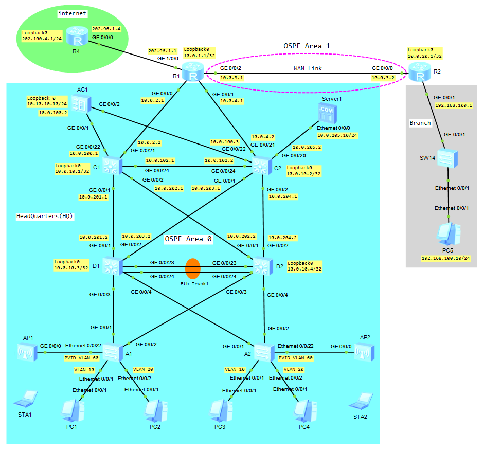

# Experiment Guide - Campus Network

### 🖧 Network Topology
  
[Download Link for eNSP Topology File](Topology/30_ExperimentGuide_CampusNetwork.topo)

Table - IPv4 Addresses
| Device | interface | IP Address /Prefix  |
| ------ | ---------- | ------------------ |
| R1     | Loopback0  | 10.0.1.1 /32       |
|        | g0/0/0     | 10.0.2.1 /24       |
|        | g0/0/1     | 10.0.4.1 /24       |
|        | g0/0/2     | 10.0.3.1 /24       |
|        | g1/0/0     | 202.96.1.1 /24     |
| R4     | Loopback0  | 202.100.4.1 /32    |
|        | g0/0/0     | 202.96.1.4 /24     |
| R2     | Loopback0  | 10.0.20.1 /32      |
|        | g0/0/0     | 10.0.3.2 /24       |
|        | g0/0/1     | 192.168.100.1 /24  |
| AC1    | Loopback0  | 10.10.10.10 /24    |
|        | VLANIF 100 | 10.0.100.2 /24     |
| C1     | Loopback0  | 10.0.10.1 /32      |
|        | VLANIF 100 | 10.0.100.1 /24     |
|        | VLANIF 101 | 10.0.2.2 /24       |
|        | VLANIF 102 | 10.0.102.1 /24     |
|        | VLANIF 201 | 10.0.201.1 /24     |
|        | VLANIF 202 | 10.0.202.1 /24     |
| C2     | Loopback0  | 10.0.10.2 /32      |
|        | VLANIF 100 | 10.0.100.3 /24     |
|        | VLANIF 104 | 10.0.4.2 /24       |
|        | VLANIF 102 | 10.0.102.2 /24     |
|        | VLANIF 203 | 10.0.203.1 /24     |
|        | VLANIF 204 | 10.0.204.1 /24     |
|        | VLANIF 205 | 10.0.205.2 /24     |
| D1     | Loopback0  | 10.0.10.3 /32      |
|        | VLANIF 201 | 10.0.201.2 /24     |
|        | VLANIF 203 | 10.0.203.2 /24     |
| D2     | Loopback0  | 10.0.10.4 /32      |
|        | VLANIF 202 | 10.0.202.2 /24     |
|        | VLANIF 204 | 10.0.204.2 /24     |

## Scenario
1) initial Configuration;
2) Configure OSPF;
3) Configure MSTP;
4) Configure VRRP;
5) Configure DHCP;
6) Configure AP Onboarding;
7) Configure WLAN Services;
8) Configure NAT;
9) Configure NAT Server;
10) Configure SSH.

## Configure VLAN (Create VLANs and Access Port, Trunk Port)

**Access Switch (A1 and A2)**

```shell
# Configure hostname
system-view
sysname A1
```

```shell
# Create VLANs
vlan batch 10 20 60 80 90
display vlan
```

| Item                          | Value                                       |
| ------------------------------| --------------------------------------------|
| Management VLAN for APs       | VLAN 60                                     |
| Service VLAN for Wireless LAN | SSID Employee: VLAN 80, SSID Guest: VLAN 90 |
| Service VLAN for Wired LAN    | VLAN 10, VLAN 20                            |

```shell
# Configure Access Port

interface Ethernet0/0/1
 port link-type access
 port default vlan 10
 quit

interface Ethernet0/0/2
 port link-type access
 port default vlan 20
 quit

display vlan
```

```shell
# Configure Trunk Port and Allowed VLANs

interface Ethernet0/0/22
 port link-type trunk
 port trunk pvid vlan 60
 port trunk allow-pass vlan 60 80 90
 quit

interface g0/0/1
 port link-type trunk
 port trunk allow-pass vlan 10 20 60 80 90
 quit

interface g0/0/2
 port link-type trunk
 port trunk allow-pass vlan 10 20 60 80 90
 quit

display port vlan
```

## Configure MSTP

**Access Switch (A1 and A2)**

```shell
stp region-configuration
 region-name HCIP
 revision-level 1
 instance 1 vlan 10
 instance 2 vlan 20
 active region-configuration
```

```shell
```

## Configure DHCP

**Access Switch (A1 and A2)**

```shell
# Configure DHCP Relay Agent

dhcp enable

interface Vlanif60
 dhcp select global
 dhcp select relay
 dhcp relay server-ip 10.0.100.2

interface Vlanif80
 dhcp select global
 dhcp select relay
 dhcp relay server-ip 10.0.100.2

interface Vlanif90
 dhcp select global
 dhcp select relay
 dhcp relay server-ip 10.0.100.2
```

```shell
```

```shell
```

---

**Access Switch (A1)**

```shell
#
sysname A1
#
vlan batch 10 20 60 80 90
#
dhcp enable
#
stp region-configuration
 region-name HCIP
 revision-level 1
 instance 1 vlan 10
 instance 2 vlan 20
 active region-configuration
#
interface Vlanif60
 dhcp select global
 dhcp select relay
 dhcp relay server-ip 10.0.100.2
#
interface Vlanif80
 dhcp select global
 dhcp select relay
 dhcp relay server-ip 10.0.100.2
#
interface Vlanif90
 dhcp select global
 dhcp select relay
 dhcp relay server-ip 10.0.100.2
#
interface Ethernet0/0/1
 port link-type access
 port default vlan 10
#
interface Ethernet0/0/2
 port link-type access
 port default vlan 20
#
interface Ethernet0/0/21
#
interface Ethernet0/0/22
 port link-type trunk
 port trunk pvid vlan 60
 port trunk allow-pass vlan 60 80 90
#
interface GigabitEthernet0/0/1
 port link-type trunk
 port trunk allow-pass vlan 10 20 60 80 90
#
interface GigabitEthernet0/0/2
 port link-type trunk
 port trunk allow-pass vlan 10 20 60 80 90
#
return
```

**Access Switch (A2)**

```shell
#
sysname A2
#
vlan batch 10 20 60 80 90
#
dhcp enable
#
stp region-configuration
 region-name HCIP
 revision-level 1
 instance 1 vlan 10
 instance 2 vlan 20
 active region-configuration
#
interface Vlanif1
#
interface Vlanif60
 dhcp select global
 dhcp select relay
 dhcp relay server-ip 10.0.100.2
#
interface Vlanif80
 dhcp select global
 dhcp select relay
 dhcp relay server-ip 10.0.100.2
#
interface Vlanif90
 dhcp select global
 dhcp select relay
 dhcp relay server-ip 10.0.100.2
#
interface Ethernet0/0/1
 port link-type access
 port default vlan 10
#
interface Ethernet0/0/2
 port link-type access
 port default vlan 20
#
interface Ethernet0/0/22
 port link-type trunk
 port trunk pvid vlan 60
 port trunk allow-pass vlan 60 80 90
#
interface GigabitEthernet0/0/1
 port link-type trunk
 port trunk allow-pass vlan 10 20 60 80 90
#
interface GigabitEthernet0/0/2
 port link-type trunk
 port trunk allow-pass vlan 10 20 60 80 90
#
return
```

**Distribution Switch (D1)**

```shell
#
sysname D1
#
vlan batch 10 20 60 80 90 201 203
#
stp instance 1 root primary
stp instance 2 root secondary
#
dhcp enable
#
stp region-configuration
 region-name HCIP
 revision-level 1
 instance 1 vlan 10
 instance 2 vlan 20
 active region-configuration
#
ip pool ap
 gateway-list 172.16.60.1
 network 172.16.60.0 mask 255.255.255.0
 option 43 sub-option 2 ip-address 10.0.100.2
#
ip pool employee
 gateway-list 172.16.80.1
 network 172.16.80.0 mask 255.255.255.0
 dns-list 114.114.114.114
#
ip pool guest
 gateway-list 172.16.90.1
 network 172.16.90.0 mask 255.255.255.0
 dns-list 114.114.114.114
#
interface Vlanif10
 ip address 172.16.10.1 255.255.255.0
 vrrp vrid 1 virtual-ip 172.16.10.254
 vrrp vrid 1 priority 110
#
interface Vlanif20
 ip address 172.16.20.1 255.255.255.0
 vrrp vrid 2 virtual-ip 172.16.20.254
#
interface Vlanif60
 ip address 172.16.60.1 255.255.255.0
 dhcp select global
 dhcp select relay
 dhcp relay server-ip 10.0.100.2
#
interface Vlanif80
 ip address 172.16.80.1 255.255.255.0
 dhcp select global
 dhcp select relay
 dhcp relay server-ip 10.0.100.2
#
interface Vlanif90
 ip address 172.16.90.1 255.255.255.0
 dhcp select global
 dhcp select relay
 dhcp relay server-ip 10.0.100.2
#
interface Vlanif201
 ip address 10.0.201.2 255.255.255.0
#
interface Vlanif203
 ip address 10.0.203.2 255.255.255.0
#
interface Eth-Trunk1
 port link-type trunk
 port trunk allow-pass vlan 10 20 60 80 90
 mode lacp-static
#
interface GigabitEthernet0/0/1
 port link-type access
 port default vlan 201
 stp disable
#
interface GigabitEthernet0/0/2
 port link-type access
 port default vlan 203
 stp disable
#
interface GigabitEthernet0/0/3
 port link-type trunk
 port trunk allow-pass vlan 10 20 60 80 90
#
interface GigabitEthernet0/0/4
 port link-type trunk
 port trunk allow-pass vlan 10 20 60 80 90
#
interface GigabitEthernet0/0/23
 eth-trunk 1
#
interface GigabitEthernet0/0/24
 eth-trunk 1
#
interface LoopBack0
 ip address 10.0.10.3 255.255.255.0
#
ospf 1 router-id 10.0.10.3
 area 0.0.0.0
  network 10.0.201.2 0.0.0.0
  network 10.0.203.2 0.0.0.0
  network 10.0.10.3 0.0.0.0
  network 172.16.10.1 0.0.0.0
  network 172.16.20.1 0.0.0.0
  network 172.16.60.1 0.0.0.0
  network 172.16.80.1 0.0.0.0
  network 172.16.90.1 0.0.0.0
#
return
```

**Distribution Switch (D2)**

```shell
#
sysname D2
#
vlan batch 10 20 60 80 90 202 204
#
stp instance 1 root secondary
stp instance 2 root primary
#
dhcp enable
#
stp region-configuration
 region-name HCIP
 revision-level 1
 instance 1 vlan 10
 instance 2 vlan 20
 active region-configuration
#
ip pool ap
 gateway-list 172.16.60.1
 network 172.16.60.0 mask 255.255.255.0
 option 43 sub-option 2 ip-address 10.0.100.2
#
ip pool employee
 gateway-list 172.16.80.1
 network 172.16.80.0 mask 255.255.255.0
 dns-list 114.114.114.114
#
ip pool guest
 gateway-list 172.16.90.1
 network 172.16.90.0 mask 255.255.255.0
 dns-list 114.114.114.114
#
interface Vlanif1
#
interface Vlanif10
 ip address 172.16.10.2 255.255.255.0
 vrrp vrid 1 virtual-ip 172.16.10.254
#
interface Vlanif20
 ip address 172.16.20.2 255.255.255.0
 vrrp vrid 2 virtual-ip 172.16.20.254
 vrrp vrid 2 priority 110
#
interface Vlanif60
 ip address 172.16.60.2 255.255.255.0
 dhcp select global
 dhcp select relay
 dhcp relay server-ip 10.0.100.2
#
interface Vlanif80
 ip address 172.16.80.2 255.255.255.0
 dhcp select global
 dhcp select relay
 dhcp relay server-ip 10.0.100.2
#
interface Vlanif90
 ip address 172.16.90.2 255.255.255.0
 dhcp select global
 dhcp select relay
 dhcp relay server-ip 10.0.100.2
#
interface Vlanif202
 ip address 10.0.202.2 255.255.255.0
#
interface Vlanif204
 ip address 10.0.204.2 255.255.255.0
#
interface Eth-Trunk1
 port link-type trunk
 port trunk allow-pass vlan 10 20 60 80 90
 mode lacp-static
#
interface GigabitEthernet0/0/1
 port link-type access
 port default vlan 202
 stp disable
#
interface GigabitEthernet0/0/2
 port link-type access
 port default vlan 204
 stp disable
#
interface GigabitEthernet0/0/3
 port link-type trunk
 port trunk allow-pass vlan 10 20 60 80 90
#
interface GigabitEthernet0/0/4
 port link-type trunk
 port trunk allow-pass vlan 10 20 60 80 90
#
interface GigabitEthernet0/0/23
 eth-trunk 1
#
interface GigabitEthernet0/0/24
 eth-trunk 1
#
interface LoopBack0
 ip address 10.0.10.4 255.255.255.0
#
ospf 1 router-id 10.0.10.4
 area 0.0.0.0
  network 10.0.202.2 0.0.0.0
  network 10.0.204.2 0.0.0.0
  network 10.0.10.4 0.0.0.0
  network 172.16.10.2 0.0.0.0
  network 172.16.20.2 0.0.0.0
  network 17.16.60.2 0.0.0.0
  network 17.16.80.2 0.0.0.0
  network 17.16.90.2 0.0.0.0
#
return
```

**Core Switch (C1)**

```shell
#
sysname C1
#
vlan batch 60 80 90 100 to 102 201 to 202
#
stp disable
#
dhcp enable
#
ip pool ap
 gateway-list 172.16.60.1
 network 172.16.60.0 mask 255.255.255.0
 option 43 hex 01 04 0A 00 64 02
#
aaa
 local-user user1 password cipher <K.R)YFE!!(I\I9%HS7.!Q!!
 local-user user1 service-type ssh
#
interface Vlanif60
 ip address 172.16.60.1 255.255.255.0
 dhcp select global
#
interface Vlanif80
 ip address 172.16.80.1 255.255.255.0
 dhcp select global
#
interface Vlanif90
 ip address 172.16.90.1 255.255.255.0
 dhcp select global
#
interface Vlanif100
 ip address 10.0.100.1 255.255.255.0
#
interface Vlanif101
 ip address 10.0.2.2 255.255.255.0
#
interface Vlanif102
 ip address 10.0.102.1 255.255.255.0
#
interface Vlanif201
 ip address 10.0.201.1 255.255.255.0
#
interface Vlanif202
 ip address 10.0.202.1 255.255.255.0
#
interface GigabitEthernet0/0/1
 port link-type access
 port default vlan 201
#
interface GigabitEthernet0/0/2
 port link-type access
 port default vlan 202
#
interface GigabitEthernet0/0/21
 port link-type access
 port default vlan 101
#
interface GigabitEthernet0/0/22
 port link-type access
 port default vlan 100
#
interface GigabitEthernet0/0/24
 port link-type access
 port default vlan 102
#
interface LoopBack0
 ip address 10.0.10.1 255.255.255.0
#
ospf 1 router-id 10.0.10.1
 area 0.0.0.0
  network 10.0.10.1 0.0.0.0
  network 10.0.100.1 0.0.0.0
  network 10.0.102.1 0.0.0.0
  network 10.0.2.2 0.0.0.0
  network 10.0.201.1 0.0.0.0
  network 10.0.202.1 0.0.0.0
  network 172.16.60.1 0.0.0.0
  network 172.16.80.1 0.0.0.0
  network 172.16.90.1 0.0.0.0
#
ip route-static 10.10.10.0 255.255.255.0 10.0.100.2
#
stelnet server enable
ssh user user1 authentication-type password
ssh user user1 service-type stelnet
ssh client first-time enable
#
user-interface con 0
user-interface vty 0 4
 authentication-mode aaa
 user privilege level 15
 protocol inbound ssh
#
return
```

**Core Switch (C2)**

```shell
#
sysname C2
#
vlan batch 60 80 90 100 102 104 203 to 205
#
dhcp enable
#
ip pool ap
 gateway-list 172.16.60.1
 network 172.16.60.0 mask 255.255.255.0
 option 43 hex 01 04 0A 00 64 02
#
interface Vlanif60
 ip address 172.16.60.2 255.255.255.0
 dhcp select global
#
interface Vlanif80
 ip address 172.16.80.2 255.255.255.0
 dhcp select global
#
interface Vlanif90
 ip address 172.16.90.2 255.255.255.0
 dhcp select global
#
interface Vlanif100
 ip address 10.0.100.3 255.255.255.0
#
interface Vlanif102
 ip address 10.0.102.2 255.255.255.0
#
interface Vlanif104
 ip address 10.0.4.2 255.255.255.0
#
interface Vlanif203
 ip address 10.0.203.1 255.255.255.0
#
interface Vlanif204
 ip address 10.0.204.1 255.255.255.0
#
interface Vlanif205
 ip address 10.0.205.2 255.255.255.0
#
interface GigabitEthernet0/0/1
 port link-type access
 port default vlan 203
#
interface GigabitEthernet0/0/2
 port link-type access
 port default vlan 204
#
interface GigabitEthernet0/0/20
 port link-type access
 port default vlan 205
#
interface GigabitEthernet0/0/21
 port link-type access
 port default vlan 104
#
interface GigabitEthernet0/0/22
 port link-type access
 port default vlan 100
#
interface GigabitEthernet0/0/23
#
interface GigabitEthernet0/0/24
 port link-type access
 port default vlan 102
#
interface LoopBack0
 ip address 10.0.10.2 255.255.255.0
#
ospf 1 router-id 10.0.10.2
 area 0.0.0.0
  network 10.0.100.3 0.0.0.0
  network 10.0.102.2 0.0.0.0
  network 10.0.4.2 0.0.0.0
  network 10.0.203.1 0.0.0.0
  network 10.0.204.1 0.0.0.0
  network 10.0.205.2 0.0.0.0
  network 172.16.60.2 0.0.0.0
  network 172.16.80.2 0.0.0.0
  network 172.16.90.2 0.0.0.0
#
return
```

**Access Controller (AC1)**

```shell
#
 sysname AC1
#
vlan batch 100
#
dhcp enable
#
ip pool ap
 gateway-list 172.16.60.1 
 network 172.16.60.0 mask 255.255.255.0 
 dns-list 114.114.114.114 
 option 43 sub-option 2 ip-address 10.0.100.2  
#
interface Vlanif100
 ip address 10.0.100.2 255.255.255.0
 dhcp select global
#
interface GigabitEthernet0/0/1
 port link-type access
 port default vlan 100
#
interface GigabitEthernet0/0/2
 port link-type access
 port default vlan 100
#
interface LoopBack0
 ip address 10.10.10.10 255.255.255.0
#
ip route-static 0.0.0.0 0.0.0.0 10.0.100.1
#
capwap source interface vlanif100
#
wlan
 security-profile name guest
 security-profile name employee
  security wpa-wpa2 psk pass-phrase %^%#BS81>e&RbD;gSDFgY0YWj}kzTTbp2Cp@3rA[=j#3
%^%# aes
 ssid-profile name guest
  ssid guest
 ssid-profile name employee
  ssid employee
 vap-profile name guest
  service-vlan vlan-id 90
  ssid-profile guest
  security-profile guest
 vap-profile name employee
  service-vlan vlan-id 80
  ssid-profile employee
  security-profile employee
 regulatory-domain-profile name Huawei
  country-code US
 serial-profile name preset-enjoyor-toeap 
 ap auth-mode no-auth
 ap-group name Huawei
  regulatory-domain-profile Huawei
  radio 0
   vap-profile employee wlan 1
   vap-profile guest wlan 2
  radio 1
   vap-profile employee wlan 1
   vap-profile guest wlan 2
  radio 2
   vap-profile employee wlan 1
   vap-profile guest wlan 2
 ap-group name default
 ap-id 0 type-id 69 ap-mac 00e0-fc23-74f0 ap-sn 210235448310E9219038
  ap-name AP1
  ap-group Huawei
 ap-id 1 type-id 69 ap-mac 00e0-fc3d-04b0 ap-sn 2102354483106D60933C
  ap-name AP2
  ap-group Huawei
#
return
```

**Router (R1)**

```shell
#
 sysname R1
#
acl number 2000  
 rule 5 permit source 10.0.0.0 0.255.255.255 
 rule 10 permit source 192.168.0.0 0.0.255.255 
 rule 15 permit source 172.16.0.0 0.0.255.255 
 rule 20 permit source 202.96.1.0 0.0.0.255 
#
aaa 
 local-user user1 password cipher %$%$Q&LA4wq7%@LYa:S8r)3)[u7b%$%$
 local-user user1 service-type ssh
#
interface GigabitEthernet0/0/0
 ip address 10.0.2.1 255.255.255.0 
#
interface GigabitEthernet0/0/1
 ip address 10.0.4.1 255.255.255.0 
#
interface GigabitEthernet0/0/2
 ip address 10.0.3.1 255.255.255.0 
#
interface GigabitEthernet1/0/0
 ip address 202.96.1.1 255.255.255.0 
 nat server protocol tcp global 202.96.1.100 ftp inside 10.0.205.19 ftp
 nat outbound 2000
#
interface LoopBack0
 ip address 10.0.1.1 255.255.255.255 
#
ospf 1 router-id 10.0.1.1 
 default-route-advertise cost 20 type 1
 area 0.0.0.0 
  network 10.0.1.1 0.0.0.0 
  network 10.0.2.1 0.0.0.0 
  network 10.0.4.1 0.0.0.0 
  network 202.96.1.1 0.0.0.0 
 area 0.0.0.1 
  network 10.0.3.1 0.0.0.0 
#
 ssh client 10.0.2.2 assign rsa-key 10.0.2.2
 ssh client first-time enable 
 stelnet server enable 
#
ip route-static 0.0.0.0 0.0.0.0 202.96.1.4
#
user-interface vty 0 4
 authentication-mode aaa
 user privilege level 15
 protocol inbound ssh
#
return
```

**Router (R4)**

```shell
#
 sysname R4
#
acl number 2000  
 rule 5 permit source 202.96.1.0 0.0.0.255 
 rule 10 permit source 202.100.4.0 0.0.0.255 
#
interface GigabitEthernet0/0/0
 ip address 202.96.1.4 255.255.255.0 
 traffic-filter inbound acl 2000
#
interface LoopBack0
 ip address 202.100.4.1 255.255.255.0 
#
return
```

**Router (R2)**

```shell
#
 sysname R2
#
interface GigabitEthernet0/0/0
 ip address 10.0.3.2 255.255.255.0 
#
interface GigabitEthernet0/0/1
 ip address 192.168.100.1 255.255.255.0 
#
interface LoopBack0
 ip address 10.0.20.1 255.255.255.255 
#
ospf 1 router-id 10.0.20.1 
 area 0.0.0.1 
  network 10.0.3.2 0.0.0.0 
  network 10.0.20.1 0.0.0.0 
  network 192.168.100.1 0.0.0.0 
#
return
```

```shell
```

```shell
```
