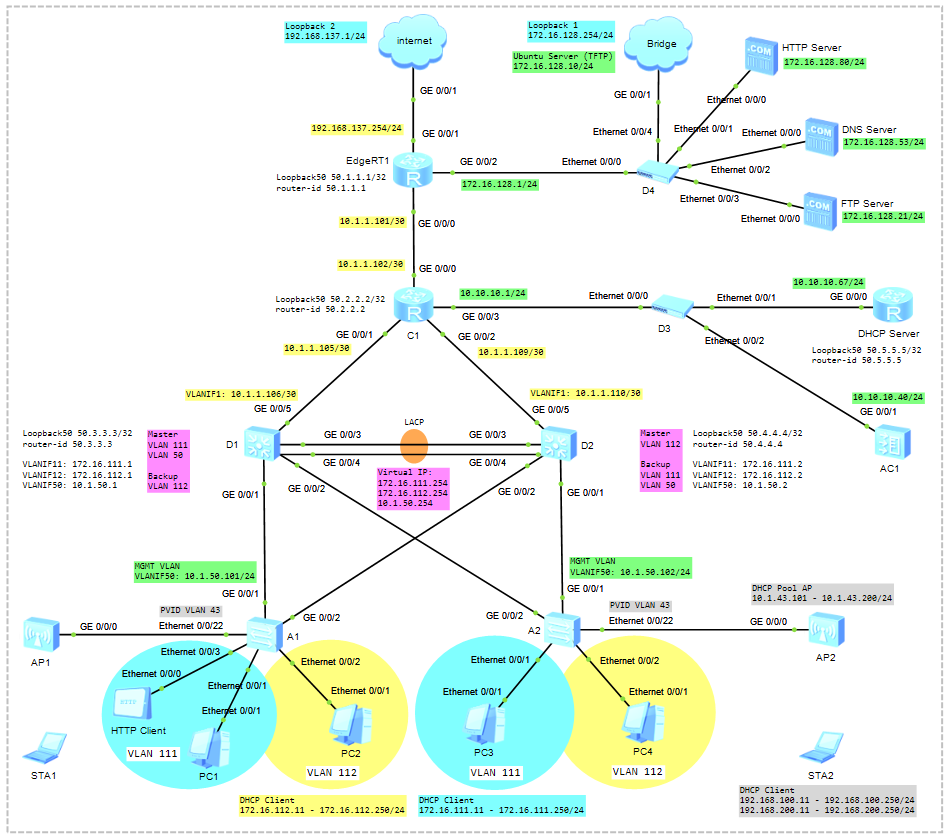

# Final Laboratory #2

### 🖧 Network Topology
  
[Download Link for eNSP Topology File](Topology/2_Final_Laboratory_NetworkTopology_v1.topo)

Table1 - WLAN Data Plan
| Item                                    | Value                                                                                                   |
| ----------------------------------------| --------------------------------------------------------------------------------------------------------|
| Management VLAN for APs                 | VLAN 43                                                                                                 |
| Service VLAN for STAs                   | SSID Staff: VLAN 100, SSID Guest: VLAN 200                                                              |
| Default Gateway for AP                  | 10.1.43.254                                                                                             |
| DHCP Pool for APs                       | 10.1.43.101 - 10.1.43.200/24                                                                            |
| Default Gateway for Staff               | 192.168.100.254                                                                                         |
| DHCP Pool for Staff                     | 192.168.100.11 - 192.168.100.250/24                                                                     |
| Default Gateway for Guest               | 192.168.200.254                                                                                         |
| DHCP Pool for Guest                     | 192.168.200.11 - 192.168.200.250/24                                                                     |
| AP Name                                 | AP1, AP2                                                                                                |
| AP Group                                | Name: ap-group1                                                                                         |
|                                         | Referenced profiles: VAP profile **VAP-Staff** and **VAP-Guest**, Regulatory domain profile **default** |
| Regulatory Domain Profile               | Name: default                                                                                           |
|                                         | Country code: KZ                                                                                        |
| SSID Profile (Staff)                    | Name: WLAN-Staff                                                                                        |
|                                         | SSID name: Staff-WiFi                                                                                   |
| Security Profile (Staff)                | Name: WLAN-Staff                                                                                        |
|                                         | Security policy: WPA-WPA2+PSK+AES                                                                       |
|                                         | Password: Huawei@123                                                                                    |
| SSID Profile (Guest)                    | Name: WLAN-Guest                                                                                        |
|                                         | SSID name: Guest-WiFi                                                                                   |
| Security Profile (Guest)                | Name: WLAN-Guest                                                                                        |
|                                         | Security policy: WPA-WPA2+PSK+AES                                                                       |
|                                         | Password: Huawei@123                                                                                    |
| VAP Profile (Staff)                     | Name: VAP-Staff                                                                                         |
|                                         | Forwarding mode: Direct forwarding                                                                      |
|                                         | Service VLAN: 100                                                                                       |
|                                         | Referenced profiles: SSID profile **WLAN-Staff** and Security profile **WLAN-Staff**                    |
| VAP Profile (Guest)                     | Name: VAP-Guest                                                                                         |
|                                         | Forwarding mode: Direct forwarding                                                                      |
|                                         | Service VLAN: 200                                                                                       |
|                                         | Referenced profiles: SSID profile **WLAN-Guest** and Security profile **WLAN-Guest**                    |

## Scenario
1) Configure VLAN (Create VLANs, Access and Trunk Port)  
   Link Aggregation. Eth-Trunk  
   MSTP (Multiple Spanning Tree Protocol)  
2) VRRP (Virtual Router Redundancy Protocol)
3) Single-Area OSPFv2
4) DHCP
5) NAT (Easy IP)
6) Remote Access (SSH, Telnet)
7) DNS and HTTP
8) FTP
9) WLAN
10) TFTP and NTP

```shell
```

```shell
```

```shell
```
