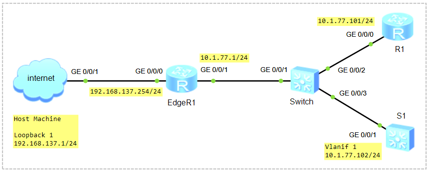

# Configure NTP Server & Client on Huawei VRP

### 🖧 Network Topology (желі топологиясы)
 

| Device Name | Role       | IP Address/Prefix |
| ----------- | ---------- | ----------------- |
| EdgeR1      | NTP Server | 10.1.77.1 /24     |
| S1          | NTP Client | 10.1.77.101 /24   |
| R1          | NTP Client | 10.1.77.102 /24   |


## Basic Device Configuration

Configure the IP Address
```shell
<Huawei> system-view
[Huawei] sysname EdgeR1

int g0/0/0
 ip address 192.168.137.254 24
int g0/0/1
 ip addr 10.1.77.1 24

display ip int brief
```

```shell
ping 192.168.137.1
 Request time out
 Request time out
```
Windows+R ➜ Turn off Windows Defender Firewall  


```shell
ping 192.168.137.1
 Reply from 192.168.137.1: bytes=56 Sequence=1 ttl=128 time=10 ms
 Reply from 192.168.137.1: bytes=56 Sequence=2 ttl=128 time=10 ms
```

```shell
ping 8.8.8.8
 Request time out
 Request time out
```

Configure the Default Static Route
```shell
ip route-static 0.0.0.0 0.0.0.0 192.168.137.1
display ip routing-table
```

```shell
ping 8.8.8.8
 Reply from 8.8.8.8: bytes=56 Sequence=1 ttl=108 time=100 ms
 Reply from 8.8.8.8: bytes=56 Sequence=2 ttl=108 time=90 ms
```

Configure the IP Address
```shell
<Huawei> system-view
[Huawei] sysname S1
[S1]

int Vlanif 1
 ip addr 10.1.77.101 24
 quit
display ip int brief
```

```shell
<Huawei> system-view
[Huawei] sysname R1
[R1]

int g0/0/0
 ip addr 10.1.77.102 24
 quit
display ip int brief
```

```shell
[S1] ping 8.8.8.8
 Request time out
 Request time out

[R1] ping 8.8.8.8
 Request time out
 Request time out
```

NAT (Easy IP)
```shell
[EdgeR1] acl 2000
          rule permit source 10.1.77.0 0.0.0.255
[EdgeR1] int g0/0/0
          nat outbound 2000
```

Configure the Default Gateway
```shell
[S1] ip route-static 0.0.0.0 0.0.0.0 10.1.77.1
[R1] ip route-static 0.0.0.0 0.0.0.0 10.1.77.1
```

Verify the Configuration
```shell
[S1] ping 8.8.8.8
 Reply from 8.8.8.8: bytes=56 Sequence=1 ttl=107 time=140 ms
 Reply from 8.8.8.8: bytes=56 Sequence=2 ttl=107 time=120 ms

[R1] ping 8.8.8.8
 Reply from 8.8.8.8: bytes=56 Sequence=1 ttl=107 time=150 ms
 Reply from 8.8.8.8: bytes=56 Sequence=2 ttl=107 time=130 ms
```

## NTP серверді конфигурациялау

**NTP серверін іске қосу**
```shell
ntp-service refclock-master 2                  // LOCAL-ды уақытты қолданады!
```

**Қосымша ақпарат**
```shell
undo ntp-service refclock-master
ntp-service unicast-server 80.241.0.72        // сыртқы NTP сервер уақытын қолданады!
```
> ЕСКЕРТУ! Қосымша ақпаратты қолдану міндетті емес!  

**NTP аутентификация**
```shell
ntp-service authentication enable
ntp-service authentication-keyid 1 authentication-mode md5 Datacom@123
ntp-service reliable authentication-keyid 1
```

**Access Control List (ACL)**
```shell
acl 2001
 rule 5 permit source 10.1.77.0 0.0.0.255
 rule 10 deny
 quit

ntp-service access peer 2001
```

**Уақыт белдеуін орнату**
```shell
[EdgeR1] quit
<EdgeR1> clock timezone Almaty add 05:00:00
<EdgeR1> clock datetime 14:26:00 2026-03-23
<EdgeR1> display clock
```

**Нәтижені тексеру**
```shell
display ntp-service status
display ntp-service sessions
display ntp-service sessions verbose
display clock
```

> display ntp-service sessions  
> reach – мәні 255 болуы керек!  
> offset - сервер мен клиент арасындағы уақыт айырмашылығы  

## NTP клиентті конфигурациялау

**Уақыт белдеуін орнату (міндетті емес, ұсынылады)**
```shell
<Huawei> clock timezone Almaty add 05:00:00
<Huawei> display clock
```

**NTP аутентификация**
```shell
ntp-service authentication enable
ntp-service authentication-keyid 1 authentication-mode md5 Datacom@123
ntp-service reliable authentication-keyid 1
```
> *Нақты физикалық құрылғыда **"hmac-sha256"** аутентификация режимін қолдану ұсынылады!*  
> **Мысалы:** ntp-service authentication-keyid 1 authentication-mode hmac-sha256 cipher Datacom@123  

**NTP серверін іске қосу**
```shell
ntp-service unicast-server 10.1.77.1 authentication-keyid 1
```
> *NTP аутентификация қолданбаған жағдайда NTP серверін іске қосу*  
> ntp-service unicast-server 10.1.77.1  

**Нәтижені тексеру**
```shell
display ntp-service status
display ntp-service sessions
display clock
```

```shell
display cu | include ntp-service
```
