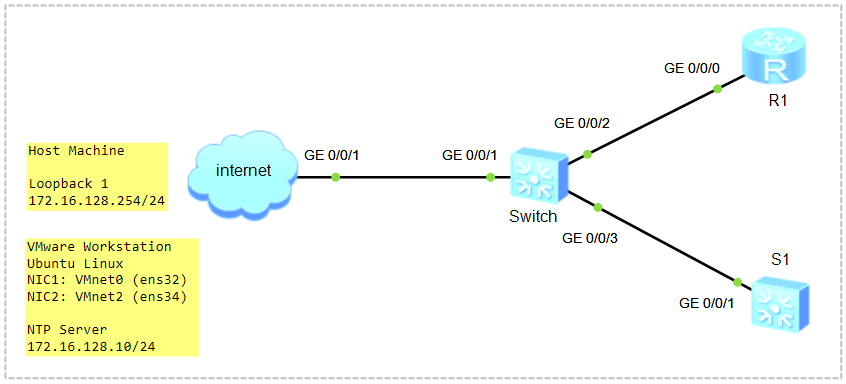

# Configure NTP Server on Linux

### 🖧 Network Topology (желі топологиясы)
  
[Download Link for eNSP Topology File](Topology/Lab10_NetworkTopology_NTP_Linux.topo)

| Device       | Role       | interface | IP Address / Prefix | Operating System |
| ------------ | ---------- | --------- | ------------------- | ---------------- |
| Ubuntu       | NTP Server | ens34     | 172.16.128.10 /24   | Linux            |
|              |            | ens32     | DHCP Assigned       |                  |
| R1           | NTP Client | g0/0/0    | 172.16.128.11 /24   | Huawei VRP       |
| S1           | NTP Client | Vlanif1   | 172.16.128.12 /24   | Huawei VRP       |
| Host Machine | Bridge     | Loopback1 | 172.16.128.254 /24  | Windows          |

### Scenario
1) Configure NTP Server on Linux;
2) Configure NTP Client on Huawei VRP.

## Configure NTP Server on Linux

VMware Workstation Pro ➜ Virtual Machine Settings ➜ Add Hardware Wizard ➜ ...  


VMware Workstation Pro ➜ Edit ➜ Virtual Network Editor ➜ Change Settings  


```shell
student@ubuntu:~$ lsb_release -a
Ubuntu 24.04.4 LTS
student@ubuntu:~$ uname -rs
Linux 6.8.0-101-generic x86_64 GNU/Linux
```


```shell
student@ubuntu:~$ ip address
```


```shell
student@ubuntu:~$ sudo nano /etc/netplan/50-cloud-init.yaml
network:
  version: 2
  renderer: networkd
  ethernets:
    ens32:
      dhcp4: true
    ens34:
      dhcp4: false
      addresses:
        - 172.16.128.10/24

CTRL+O, ENTER, CTRL+X
```
> **ЕСКЕРТУ:** *YAML файлында бос орындар (indentation) өте маңызды. Әр қатарда 2 бос орын қолдануды ұмытпаңыз! (Tab пернесін қолданбаған дұрыс)*  


```shell
student@ubuntu:~$ sudo netplan apply
немесе
student@ubuntu:~$ sudo netplan try
```

```shell
student@ubuntu:~$ ip address
```


```shell
student@ubuntu:~$ networkctl status
```


Ping from Ubuntu to Host Machine (Loopback 1)
```shell
student@ubuntu:~$ ping -c4 172.16.128.254
 4 packets transmitted, 0 received, 100% packet loss, time 3058ms
```
Windows+R ➜ Turn off Windows Defender Firewall  


```shell
student@ubuntu:~$ ping -c4 172.16.128.254
 64 bytes from 172.16.128.254: icmp_seq=1 ttl=128 time=0.230 ms
```

**Chrony пакетін (package) орнату**

> Package атауы: **chrony**  
> Daemon/Service атауы: **chronyd**  

> **chronyd** – the actual daemon to sync and serve via the Network Time Protocol  
> **chronyc** – command-line interface for the chrony daemon  

```shell
$ sudo apt update 
$ sudo apt install chrony
```

```shell
$ sudo systemctl status chronyd
```

```shell
$ ss -tulpn
$ netstat -tulpn
```

Уақыт белдеуін (Time Zone) өзгерту
```shell
$ sudo timedatectl set-timezone Asia/Almaty
$ timedatectl status
```

**NTP серверді конфигурациялау**

> NTP Pool Time Servers Link: https://www.ntppool.org/zone/kz  
> Time Zones in Kazakhstan https://www.timeanddate.com/time/zone/kazakhstan  

```shell
$ sudo nano /etc/chrony/chrony.conf
#pool 2.debian.pool.ntp.org iburst

# Kazakhstan NTP pool
server ntp.nic.kz iburst
pool 2.kz.pool.ntp.org iburst
pool 1.kz.pool.ntp.org iburst

# Global NTP pool
pool time.google.com iburst
pool time.cloudflare.com iburst

# Log settings
logdir /var/log/chrony
log measurements statistics tracking

# RTC sync (синхрондау)
rtcsync

# Time adjustment (уақыт дәлдігін реттеу)
makestep 1.0 3

# Listen on all interfaces
bindcmdaddress 0.0.0.0
bindcmdaddress ::

# Allow NTP client access from Local Network
allow 172.16.128.0/24
```
> артық DNS атауларды "#" comment-ге алып, төменгі қатарға Қазақстанға ең жақын NTP сервердің DNS атауын енгіземіз!  

NTP портын (123/UDP) ашу
```shell
$ sudo ufw enable
$ sudo ufw allow from 172.16.128.0/24 to any port 123 proto udp
$ sudo ufw reload
```

Daemon-ды қайта жүктеу және ...
```shell
$ sudo systemctl restart chronyd
$ sudo systemctl enable chrony
```

Нәтижені тексеру
```shell
$ sudo chronyc sources -v
$ sudo chronyc tracking
$ sudo chronyc activity

$ sudo apt install ntpdate
$ sudo ntpdate -q 80.241.0.72
```

```shell
```

```shell
```

```shell
```

```shell
```

```shell
```
