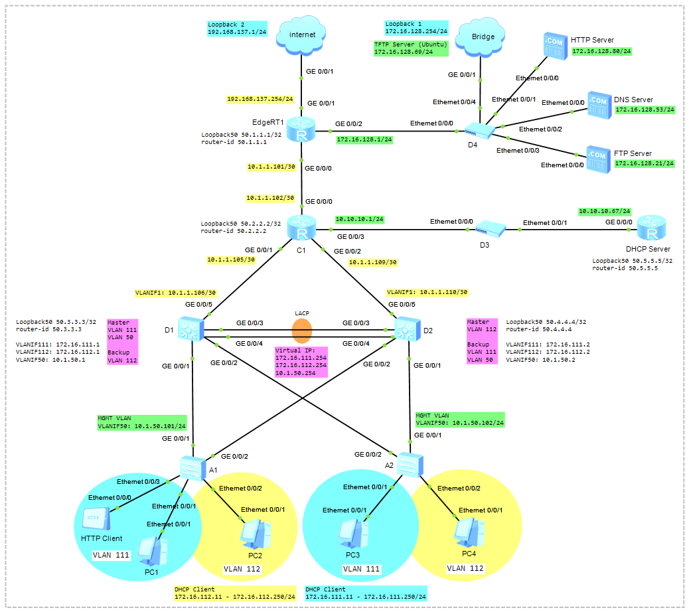

# Configure Network Services (DHCP, HTTP, DNS, FTP, TFTP, NTP, Telnet, SSH)

### 🖧 Network Topology
  
[Download Link for eNSP Topology File](Topology/Lab10_NetworkTopology_NetworkServices.topo)

## Scenario
1) Configure VLAN (Create VLANs and Access Port, Trunk Port)  
   LACP Link Aggregation. Eth-Trunk  
   MSTP (Multiple Spanning Tree Protocol)  
4) VRRP (Virtual Router Redundancy Protocol)
5) Single-Area OSPF
6) DHCP
7) NAT (Easy IP)
8) Remote Access (SSH, Telnet)
9) HTTP and DNS
10) FTP
11) TFTP
12) NTP (EdgeR1)

## A1 and A2 Switch
```shell
undo terminal monitor
system-view
sysname A1
```

Create VLANs
```shell
vlan batch 111 112 50

vlan 111
 description Service VLAN
 quit
vlan 112
 description Service VLAN
 quit
vlan 50
 description MGMT VLAN
 quit

display vlan
```

Configure Access Port
```shell
interface Ethernet0/0/1
 port link-type access
 port default vlan 111
 quit
interface Ethernet0/0/3
 port link-type access
 port default vlan 111
 quit
interface Ethernet0/0/2
 port link-type access
 port default vlan 112
 quit

display vlan
```

Configure Trunk Port and Allowed VLANs
```shell
interface g0/0/1
 port link-type trunk
 port trunk allow-pass vlan 111 112 50
 quit

interface g0/0/2
 port link-type trunk
 port trunk allow-pass vlan 111 112 50
 quit

display port vlan
```

## D1 and D2 Switch
```shell
undo terminal monitor
system-view
sysname D1
```

Create VLANs
```shell
vlan batch 111 112 50

vlan 111
 description Service VLAN
 quit
vlan 112
 description Service VLAN
 quit
vlan 50
 description MGMT VLAN
 quit

display vlan
```

Configure Trunk Port and Allowed VLANs
```shell
interface g0/0/1
 port link-type trunk
 port trunk allow-pass vlan 111 112 50
 quit

interface g0/0/2
 port link-type trunk
 port trunk allow-pass vlan 111 112 50
 quit

display port vlan
```

Configure LACP Link Aggregation
```shell
interface Eth-Trunk 1                                          // Create Eth-Trunk
 port link-type trunk                                          // Trunk Port
 port trunk allow-pass vlan 111 112 50                         // Allowed VLANs         
 mode lacp-static                                              // Link Aggregation Mode
 quit

display port vlan
```

Add a Port to the Eth-Trunk
```shell
interface g0/0/3
 eth-trunk 1
 quit
interface g0/0/4
 eth-trunk 1
 quit
```

Verify Configuration
```shell
display int brief
display eth-trunk 1
display int eth-trunk 1
```

Configure MSTP
```shell
display stp
```
```shell
stp region-configuration
 region-name HQ1
 revision-level 1
 instance 1 vlan 111
 instance 2 vlan 112
 instance 3 vlan 50
 active region-configuration
 check region-configuration
 quit
```
```shell
display cu | begin stp
```

D1 Switch
```shell
stp instance 1 root primary
stp instance 3 root primary
stp instance 2 root secondary
```

D2 Switch
```shell
stp instance 2 root primary
stp instance 1 root secondary
stp instance 3 root secondary
```

## A1 and A2 Switch

Configure MSTP
```shell
stp region-configuration
 region-name HQ1
 revision-level 1
 instance 1 vlan 111
 instance 2 vlan 112
 instance 3 vlan 50
 active region-configuration
 check region-configuration
 quit
```
```shell
display cu | begin stp
```

Verify Configuration
```shell
display stp instance 1 brief
display stp instance 2 brief
display stp instance 3 brief
```
немесе
```shell
display stp vlan 111
display stp vlan 112
display stp vlan 50
```

## Configure VRRP (Virtual Router Redundancy Protocol)

D1 Switch
```shell
interface vlanif 111
 ip address 172.16.111.1 24
 vrrp vrid 111 virtual-ip 172.16.111.254
 vrrp vrid 111 priority 105
 quit

interface vlanif 112
 ip address 172.16.112.1 24
 vrrp vrid 112 virtual-ip 172.16.112.254
 quit

interface vlanif 50
 ip address 10.1.50.1 24
 vrrp vrid 50 virtual-ip 10.1.50.254
 vrrp vrid 50 priority 105
 quit

display ip int brief
display vrrp brief
```

D2 Switch
```shell
interface vlanif 111
 ip address 172.16.111.2 24
 vrrp vrid 111 virtual-ip 172.16.111.254
 quit

interface vlanif 112
 ip address 172.16.112.2 24
 vrrp vrid 112 virtual-ip 172.16.112.254
 vrrp vrid 112 priority 105
 quit

interface vlanif 50
 ip address 10.1.50.2 24
 vrrp vrid 50 virtual-ip 10.1.50.254
 quit

display ip int brief
display vrrp brief
```

## Configure Single-Area OSPF

D1 Switch

```shell
interface vlanif 1
 ip address 10.1.1.106 30
 quit
interface Loopback 50
 ip address 50.3.3.3 32
 quit

display ip int brief
```

```shell
display ip int brief

ospf 1 router-id 50.3.3.3
 area 0
 network 10.1.1.104 0.0.0.3
 network 172.16.111.0 0.0.0.255
 network 172.16.112.0 0.0.0.255
 network 10.1.50.0 0.0.0.255
 network 50.3.3.3 0.0.0.0
 quit
 quit

display cu | begin ospf
```

D2 Switch
```shell
interface vlanif 1
 ip address 10.1.1.110 30
 quit
interface Loopback 50
 ip address 50.4.4.4 32
 quit

display ip int brief
```

```shell
display ip int brief

ospf 1 router-id 50.4.4.4
 area 0
 network 10.1.1.108 0.0.0.3
 network 172.16.111.0 0.0.0.255
 network 172.16.112.0 0.0.0.255
 network 10.1.50.0 0.0.0.255
 network 50.4.4.4 0.0.0.0
 quit
 quit

display ospf peer brief
```

C1 Switch
```shell
undo terminal monitor
system-view
sysname C1
```

```shell
interface g0/0/0
 ip address 10.1.1.102 30
 quit
interface g0/0/1
 ip address 10.1.1.105 30
 quit
interface g0/0/2
 ip address 10.1.1.109 30
 quit
interface g0/0/3
 ip address 10.10.10.1 24
 quit
interface Loopback 50
 ip address 50.2.2.2 32
 quit

display ip int brief
```

```shell
display ip int brief

ospf 1 router-id 50.2.2.2
 area 0
 network 10.1.1.100 0.0.0.3
 network 10.1.1.104 0.0.0.3
 network 10.1.1.108 0.0.0.3
 network 10.10.10.0 0.0.0.255
 network 50.2.2.2 0.0.0.0
 quit
 quit

display ospf peer brief
```

EdgeR1 Router
```shell
undo terminal monitor
system-view
sysname EdgeR1
```

```shell
interface g0/0/0
 ip address 10.1.1.101 30
 quit
interface g0/0/2
 ip address 172.16.128.1 24
 quit
interface g0/0/1
 ip address 192.168.137.254 24
 quit
interface Loopback 50
 ip address 50.1.1.1 32
 quit

display ip int brief
```

```shell
ping 192.168.137.1
 Request time out
```
Windows+R ➜ Turn off Windows Defender Firewall  

```shell
ping 192.168.137.1
 Reply from 192.168.137.1: bytes=56 Sequence=2 ttl=128 time=10 ms
```

```shell
display ip int brief

ospf 1 router-id 50.1.1.1
 area 0
 network 10.1.1.100 0.0.0.3
 network 172.16.128.0 0.0.0.255
 network 50.1.1.1 0.0.0.0
 quit
 quit

display ospf peer brief
```

DHCP Router
```shell
undo terminal monitor
system-view
sysname DHCP
```

```shell
interface g0/0/0
 ip address 10.10.10.67 24
 quit
interface Loopback 50
 ip address 50.5.5.5 32
 quit

display ip int brief
```

```shell
display ip int brief

ospf 1 router-id 50.5.5.5
 area 0
 network 10.10.10.0 0.0.0.255
 network 50.5.5.5 0.0.0.0
 quit
 quit

display ospf peer brief
```

## Configure DHCP Server
```shell
dhcp enable

ip pool VLAN111
 network 172.16.111.0 mask 24
 gateway-list 172.16.111.254
 dns-list 8.8.8.8
 excluded-ip-address 172.16.111.1 172.16.111.100
 excluded-ip-address 172.16.111.201 172.16.111.253
 lease day 5
 quit

ip pool VLAN112
 network 172.16.112.0 mask 24
 gateway-list 172.16.112.254
 dns-list 172.16.128.53
 excluded-ip-address 172.16.112.1 172.16.112.100
 excluded-ip-address 172.16.112.201 172.16.112.253
 lease day 5
 quit

interface g0/0/0
 dhcp select global
 quit
```

Verify Configuration
```shell
display ip pool
display ip pool name VLAN111
display dhcp server statistics
```

DHCP Relay Agent (D1 and D2 Switch)
```shell
dhcp enable

interface vlanif 111
 dhcp select relay
 dhcp relay server-ip 10.10.10.67
 quit

interface vlanif 112
 dhcp select relay
 dhcp relay server-ip 10.10.10.67
 quit
```

```shell
PC1> ipconfig /renew
PC2> ipconfig
PC3> ipconfig
PC4> ipconfig
```

## Configure HTTP and DNS

DNS Server
```shell
Basic Config:
 Local Address: 172.16.128.53
 Subnet Mask: 255.255.255.0
 Gateway: 172.16.128.1
 DNS: 8.8.8.8                        // Public DNS Server

Server info:
 Hostname: lab.local
 IP Address: 172.16.128.80          // Web Server
 "Add" батырмасын басамыз!
 DNSServer ➜ Service ➜ Start
```

HTTP Server
```shell
Basic Config:
 Local Address: 172.16.128.80
 Subnet Mask: 255.255.255.0
 Gateway: 172.16.128.1
 DNS: 172.16.128.53

Server info:
 Root Path: C:\Users\student\Documents\www\
 HTTPServer ➜ Service ➜ Start
```

C:\Users\student\Documents\www\index.html
```shell
<!DOCTYPE html>
<html>
<head>
   	 <meta charset="UTF-8">
   	 <title>Example</title>
</head>
<body>
   	 <h1>Welcome to Almaty!</h1>
</body>
</html>
```

HTTP Client
```shell
Basic Config:
 Local Address: 172.16.11.80
 Subnet Mask: 255.255.255.0
 Gateway: 172.16.11.254
 DNS: 172.16.128.53

 HTTPClient ➜ URL: http://lab.local
немесе
 HTTPClient ➜ URL: http://172.16.128.80

Нәтиже:
HTTP/1.1 200 OK
Server: ENSP HttpServer
Auth: HUAWEI
Cache-Control: private
Content-Type: text/html
Content-Length: 179
```

## Configure NAT (Easy IP)

EdgeR1
```shell
acl 2000
 rule permit source 172.16.111.0 0.0.0.255
 rule permit source 172.16.112.0 0.0.0.255
 quit

int g0/0/1
 nat outbound 2000
 quit
```

Verify Configuration
```shell
display cu section acl
display nat outbound
```

Default Static Route
```shell
ip route-static 0.0.0.0 0.0.0.0 192.168.137.1

display cu | include static
```

Advertise the Default Route
```shell
ospf 1
 default-route-advertise
 quit
```

C1 Switch
```shell
display ip routing-table
display ip routing-table protocol ospf
display ospf routing
```

```shell
PC1> ping 8.8.8.8
PC2> ping 8.8.8.8
PC3> ping 8.8.8.8
PC4> ping 8.8.8.8
 From 8.8.8.8: bytes=32 seq=3 ttl=105 time=156 ms
```

NAT Table
```shell
[EdgeR1] display nat session all verbose
```

## A1 and A2 Switch

A1 Switch
```shell
# Create VLANIF interface
interface vlanif 50
 ip address 10.1.50.101 24
 quit
display ip int brief
```
```shell
# Default Gateway
ip route-static 0.0.0.0 0.0.0.0 10.1.50.254
```

A2 Switch
```shell
# Create VLANIF interface
interface vlanif 50
 ip address 10.1.50.102 24
 quit
display ip int brief
```
```shell
# Default Gateway
ip route-static 0.0.0.0 0.0.0.0 10.1.50.254
```

A1 Switch
```shell
ping 10.1.50.102
 Reply from 10.1.50.102: bytes=56 Sequence=4 ttl=255 time=30 ms

ping 50.3.3.3
 Reply from 50.3.3.3: bytes=56 Sequence=3 ttl=255 time=20 ms

ping 50.4.4.4
 Reply from 50.4.4.4: bytes=56 Sequence=5 ttl=255 time=60 ms

ping 50.2.2.2
 Reply from 50.2.2.2: bytes=56 Sequence=1 ttl=254 time=60 ms

ping 50.1.1.1
 Reply from 50.1.1.1: bytes=56 Sequence=3 ttl=253 time=70 ms

ping 50.5.5.5
 Reply from 50.5.5.5: bytes=56 Sequence=3 ttl=253 time=70 ms
```

## Configure Remote Access (SSH, Telnet) - A1, A2, D1, D2, C1, EdgeR1, DHCP

Step1: Configure Local User Authentication and Authorization
```shell
aaa
 local-user student password cipher Huawei@123
 local-user student service-type terminal ssh telnet
 local-user student privilege level 15
 quit
```

Step2: Configure SSH User Settings
```shell
ssh user student authentication-type password
ssh user student service-type stelnet
```

Step3: Enable SSH/Telnet
```shell
stelnet server enable
display ssh server status
```
```shell
display telnet server status
telnet server enable
```

Step4: Generate RSA Key
```shell
rsa local-key-pair create

Warning: Confirm to replace them! Continue? [Y/N] Y
Input the bits in the modulus[default = 3072]: 2048

display rsa local-key-pair public
```

Step5: Configure VTY Lines
```shell
user-interface vty 0 4
 authentication-mode aaa
 protocol inbound all
 quit
```

SSH server Permit interface
```shell
[Switch] ssh server-source -i Vlanif 50
```
```shell
[Router] ssh server permit interface Loopback 50
```

```shell
display cu | include ssh
display cu | include stelnet
```

**Verify SSH Connectivity**
```shell
# Configure SSH Client Settings
[A1] ssh client first-time enable

[A1] stelnet 50.3.3.3
Please input the username: student
The server is not authenticated. Continue to access it? (y/n)[n]: y
Save the server's public key? (y/n)[n]: y
Enter password: Huawei@123

<D1> system-view
[D2] quit
<D1> quit
[A1]
```

```shell
[A1] stelnet 50.4.4.4
[A1] stelnet 50.2.2.2
[A1] stelnet 50.1.1.1
[A1] stelnet 50.5.5.5
[A1] stelnet 10.1.50.102
```

**Verify Telnet Connectivity**
```shell
<A1> telnet 50.3.3.3
 Username: student
 Password: Huawei@123

<D1> system-view
[D2] quit
<D1> quit
<A1> 
```

```shell
<A1> telnet 50.4.4.4
<A1> telnet 50.2.2.2
<A1> telnet 50.1.1.1
<A1> telnet 50.5.5.5
<A1> telnet 10.1.50.102
```
