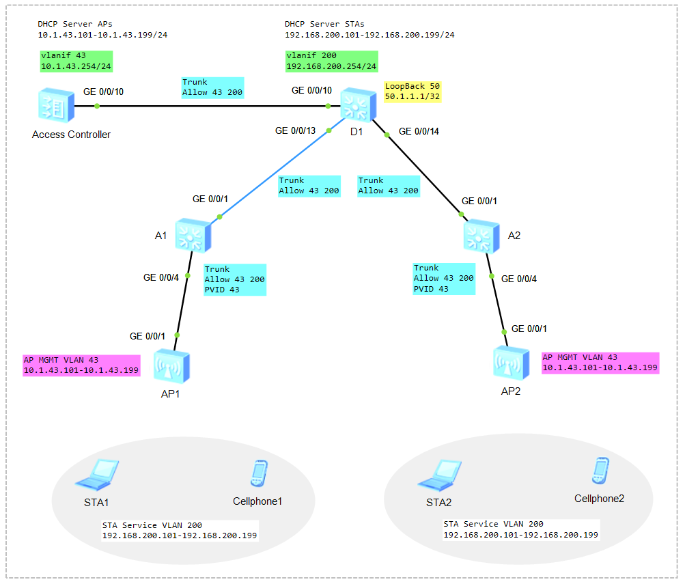

# Configure WLAN on Huawei VRP

### 🖧 Network Topology (желі топологиясы)
  
[Download Link for eNSP Topology File](Topology/Lab11_NetworkTopology_WLAN.topo)

| Item                            | Value                                                                                     |
| ------------------------------- | ----------------------------------------------------------------------------------------- |
| Management VLAN for APs         | VLAN 43                                                                                   |
| Service VLAN for STAs           | VLAN 200                                                                                  |
| Default Gateway address of APs  | 10.1.43.254                                                                               |
| IP address Pool APs             | 10.1.43.100 - 10.1.43.200                                                                 |
| Default Gateway address of STAs | 192.168.200.254                                                                           |
| IP address Pool STAs            | 192.168.200.10 - 192.168.200.250                                                          |
| AP group                        | Name: ap-group1                                                                           |
|                                 | Referenced profiles: VAP profile **WLAN-Guest** and Regulatory domain profile **default** |
| Regulatory domain profile       | Name: default                                                                             |
|                                 | Country code: KZ                                                                          |
| SSID profile                    | Name: WLAN-Guest                                                                          |
|                                 | SSID name: Guest-WiFi                                                                     |
| Security profile                | Name: WLAN-Guest                                                                          |
|                                 | Security policy: WPA-WPA2+PSK+AES                                                         |
|                                 | Password: Huawei@123                                                                      |
| VAP profile                     | Name: WLAN-Guest                                                                          |
|                                 | Forwarding mode: direct forwarding                                                        |
|                                 | Service VLAN: 200                                                                         |
|                                 | Referenced profiles: SSID profile **WLAN-Guest** and Security profile **WLAN-Guest**      |
|                                 |  |

## Step1: Configure the IP Address

```shell
<Huawei> system-view
[Huawei] sysname EdgeR1
[EdgeR1]

int g0/0/0
 ip address 192.168.137.254 24
 quit
int g0/0/1
 ip address 10.1.77.1 24
 quit
display ip int brief
```
