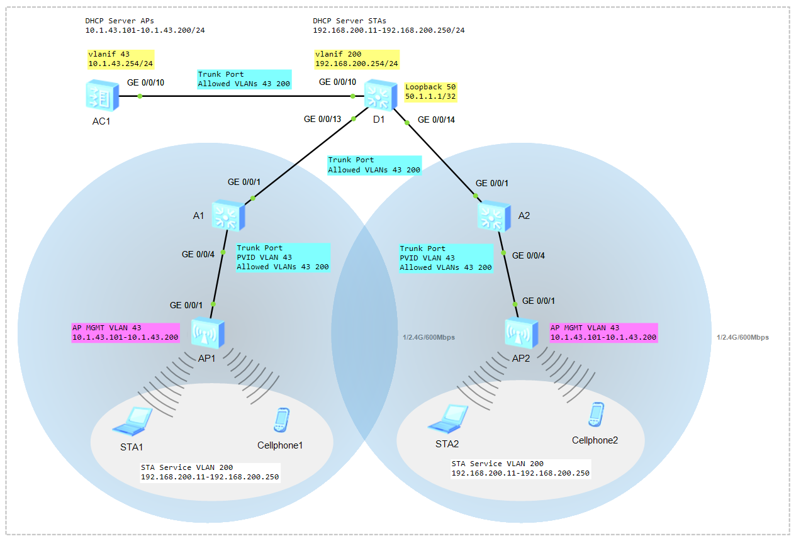

# Configure WLAN on Huawei VRP

### 🖧 Network Topology (желі топологиясы)
  
[Download Link for eNSP Topology File](Topology/Lab11_NetworkTopology_WLAN_v1.topo)

Table1 - WLAN Data Plan
| Item                            | Value                                                                                     |
| ------------------------------- | ----------------------------------------------------------------------------------------- |
| Management VLAN for APs         | VLAN 43                                                                                   |
| Service VLAN for STAs           | VLAN 200                                                                                  |
| Default Gateway for AP          | 10.1.43.254                                                                               |
| DHCP Pool for AP                | 10.1.43.100 - 10.1.43.200/24                                                              |
| Default Gateway for Guest       | 192.168.200.254                                                                           |
| DHCP Pool for Guest             | 192.168.200.10 - 192.168.200.250/24                                                       |
| AP Name                         | AP1, AP2                                                                                  |
| AP Group                        | Name: ap-group1                                                                           |
|                                 | Referenced profiles: VAP profile **VAP-Guest** and Regulatory domain profile **default**  |
| Regulatory Domain Profile       | Name: default                                                                             |
|                                 | Country code: KZ                                                                          |
| SSID Profile                    | Name: WLAN-Guest                                                                          |
|                                 | SSID name: Guest-WiFi                                                                     |
| Security Profile                | Name: WLAN-Guest                                                                          |
|                                 | Security policy: WPA-WPA2+PSK+AES                                                         |
|                                 | Password: Huawei@123                                                                      |
| VAP Profile                     | Name: VAP-Guest                                                                           |
|                                 | Forwarding mode: Direct forwarding                                                        |
|                                 | Service VLAN: 200                                                                         |
|                                 | Referenced profiles: SSID profile **WLAN-Guest** and Security profile **WLAN-Guest**      |

> Wireless STA (Station) — клиент құрылғы  

## A1 and A2 Switch

```shell
<Huawei> system-view
[Huawei] sysname A1
[A1]
```

```shell
interface g0/0/4
 poe enable
```

Create VLANs
```shell
vlan batch 43 200

vlan 43
 description MGMT VLAN
vlan 200
 description Service VLAN

display vlan
```

Configure the Trunk Port and Allowed VLANs
```shell
interface g0/0/1
 port link-type trunk
 port trunk allow-pass vlan 43 200

interface g0/0/4
 port link-type trunk
 port trunk pvid vlan 43
 port trunk allow-pass vlan 43 200

display port vlan
```
> PVID (Port VLAN ID) — Switch кіріс трафик үшін VLAN43 tag-ін алады, нәтижесінде untagged Frame-нен tagged Frame-ге өзгереді. Ал шығыс трафик үшін tag-ті алып тастап, AP-ға untagged Frame жібереді. Бұл Cisco әлеміндегі **Native VLAN** ұғымына толық сәйкес келеді. Default жағдайда кез келген Trunk портында бұл мән VLAN 1 болады!  

## D1 Switch

```shell
<Huawei> system-view
[Huawei] sysname D1
[D1]
```

Create VLANs
```shell
vlan batch 43 200

vlan 43
 description MGMT VLAN
vlan 200
 description Service VLAN

display vlan
```

Configure the Trunk Port and Allowed VLANs
```shell
interface g0/0/10
 port link-type trunk
 port trunk allow-pass vlan 43 200

interface g0/0/13
 port link-type trunk
 port trunk allow-pass vlan 43 200

interface g0/0/14
 port link-type trunk
 port trunk allow-pass vlan 43 200

display port vlan
```

Configure the VLANIF Interface
```shell
interface vlanif 200
 ip address 192.168.200.254 24
 description Default Gateway for STAs

display ip int brief
```

```shell
interface Loopback 50
 ip address 50.1.1.1 32
```

DHCP Pool for STAs
```shell
dhcp enable
ip pool VLAN200
 network 192.168.200.0 mask 24
 gateway-list 192.168.200.254
 dns-list 8.8.8.8
 excluded-ip-address 192.168.200.1 192.168.200.10
 excluded-ip-address 192.168.200.251 192.168.200.253
 lease day 5

interface vlanif 200
 dhcp select global

display ip pool
```

## AC (Access Controller)

```shell
<Huawei> system-view
[Huawei] sysname AC1
[AC1]
```

Create VLANs
```shell
vlan batch 43 200

vlan 43
 description MGMT VLAN
vlan 200
 description Service VLAN

display vlan brief
```

Configure the Trunk Port and Allowed VLANs
```shell
interface g0/0/10
 port link-type trunk
 port trunk allow-pass vlan 43 200

display port vlan
```

Configure the VLANIF Interface
```shell
interface vlanif 43
 ip address 10.1.43.254 24
 description Default Gateway for APs

display ip int brief
```

DHCP Pool for APs
```shell
dhcp enable
 ip pool AP
 network 10.1.43.0 mask 24
 gateway-list 10.1.43.254
 dns-list 8.8.8.8
 excluded-ip-address 10.1.43.1 10.1.43.100
 excluded-ip-address 10.1.43.201 10.1.43.253
 lease day 5

interface vlanif 43
 dhcp select global

display ip pool
```

**Create the AP Group**
```shell
wlan
 ap-group name ap-group1
 quit
```

**Create a Regulatory Domain Profile**
```shell
wlan
 regulatory-domain-profile name default
 country-code KZ
 quit
```

**AP Group пен Regulatory Domain Profile-ды байланыстыру**
```shell
wlan
 ap-group name ap-group1
 regulatory-domain-profile name default
 quit
```

**CAPWAP tunnel**
```shell
[AC1] capwap source interface Vlanif 43
```

**Import APs to the AC**
```shell
wlan
 ap auth-mode mac-auth
 ap-id 0 ap-mac 00E0-FC84-1B70
 ap-name AP1
 ap-group ap-group1
 quit

 ap-id 1 ap-mac 00E0-FCDA-5BF0
 ap-name AP2
 ap-group ap-group1
 quit

display ap all
```
> Access Point Model: **AirEngine 6761-21**  
> Access Point Type: **AP2050DN**  
> AP1 MAC Address: 90F9-B722-2000  
> AP2 MAC Address: 90F9-B722-17C0  

**Create a Security Profile**
```shell
wlan
 security-profile name WLAN-Guest
 security wpa-wpa2 psk pass-phrase Huawei@123 aes
 quit
```

**Create a SSID Profile**
```shell
wlan
ssid-profile name WLAN-Guest
ssid Guest-WiFi
quit
```

**Create a VAP Profile**
```shell
wlan
 vap-profile name VAP-Guest
 forward-mode direct-forward
 service-vlan vlan-id 200
 security-profile WLAN-Guest
 ssid-profile WLAN-Guest
 quit
```

**Bind the VAP Profile to the AP Group**
```shell
wlan
 ap-group name ap-group1
 vap-profile VAP-Guest wlan 1 radio all
```

**Verify the Configuration**
```shell
STA1> ipconfig
STA2> ipconfig
```

```shell
STA1> ping 50.1.1.1
STA2> ping 50.1.1.1
```

```shell
<AC1> display station all
```
