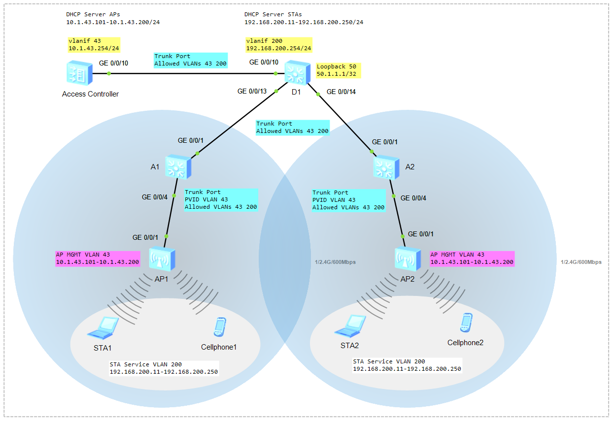

# Configure WLAN on Huawei VRP

### 🖧 Network Topology (желі топологиясы)
  
[Download Link for eNSP Topology File](Topology/Lab11_NetworkTopology_WLAN_v1.topo)

Table - WLAN Data Plan
| Item                            | Value                                                                                     |
| ------------------------------- | ----------------------------------------------------------------------------------------- |
| Management VLAN for APs         | VLAN 43                                                                                   |
| Service VLAN for STAs           | VLAN 200                                                                                  |
| Default Gateway address of APs  | 10.1.43.254                                                                               |
| IP address Pool APs             | 10.1.43.100-10.1.43.200/24                                                                |
| Default Gateway address of STAs | 192.168.200.254                                                                           |
| IP address Pool STAs            | 192.168.200.10-192.168.200.250/24                                                         |
| AP Group                        | Name: ap-group1                                                                           |
|                                 | Referenced profiles: VAP profile **VAP-Guest** and Regulatory domain profile **default**  |
| Regulatory Domain Profile       | Name: default                                                                             |
|                                 | Country code: KZ                                                                          |
| SSID Profile                    | Name: WLAN-Guest                                                                          |
|                                 | SSID name: Guest-WiFi                                                                     |
| Security Profile                | Name: WLAN-Guest                                                                          |
|                                 | Security policy: WPA-WPA2+PSK+AES                                                         |
|                                 | Password: Huawei@123                                                                      |
| VAP Profile                     | Name: VAP-Guest                                                                           |
|                                 | Forwarding mode: Direct forwarding                                                        |
|                                 | Service VLAN: 200                                                                         |
|                                 | Referenced profiles: SSID profile **WLAN-Guest** and Security profile **WLAN-Guest**      |


## A1 and A2 Switch

```shell
<Huawei> undo terminal monitor

<Huawei> system-view
[Huawei] sysname A1
[A1]
```

```shell
interface g0/0/4
 poe enable
```

```shell
vlan batch 43 200

[A1] vlan 43
[A1-vlan43] description APs

[A1] vlan 200
[A1-vlan200] description STAs

display vlan
```

```shell
interface g0/0/1
 port link-type trunk
 port trunk allow-pass vlan 43 200

interface g0/0/4
 port link-type trunk
 port trunk pvid vlan 43
 port trunk allow-pass vlan 43 200

display port vlan
```

## D1 Switch

```shell
<Huawei> undo terminal monitor

<Huawei> system-view
[Huawei] sysname D1
[D1]
```

```shell
vlan batch 43 200
display vlan

interface g0/0/10
 port link-type trunk
 port trunk allow-pass vlan 43 200

interface g0/0/13
 port link-type trunk
 port trunk allow-pass vlan 43 200

interface g0/0/14
 port link-type trunk
 port trunk allow-pass vlan 43 200

display port vlan
```

```shell
interface Loopback 50
 ip address 50.1.1.1 32

interface vlanif 200
 ip address 192.168.200.254 24
 description Gateway for STAs

display ip int brief
```
> Switched Virtual Interface (SVI)  

```shell
dhcp enable
ip pool STA
 network 192.168.200.0 mask 24
 gateway-list 192.168.200.254
 dns-list 8.8.8.8
 excluded-ip-address 192.168.200.1 192.168.200.10
 excluded-ip-address 192.168.200.251 192.168.200.253
 lease day 5

interface vlanif 200
 dhcp select global

display ip pool
```

## Access Controller

```shell
<Huawei> undo terminal monitor

<Huawei> system-view
[Huawei] sysname AC1
[AC1]
```

```shell
vlan batch 43 200
display vlan brief

interface g0/0/10
 port link-type trunk
 port trunk allow-pass vlan 43 200

display vlan brief
display port vlan
```

```shell
interface vlanif 43
 ip address 10.1.43.254 24
 description Gateway for APs

display ip int brief
```

```shell
dhcp enable
 ip pool AP
 network 10.1.43.0 mask 24
 gateway-list 10.1.43.254
 dns-list 8.8.8.8
 excluded-ip-address 10.1.43.1 10.1.43.100
 excluded-ip-address 10.1.43.201 10.1.43.253
 lease day 5

interface vlanif 43
 dhcp select global

display ip pool
```
> option 43 sub-option 2 ip-address 10.1.43.254  

**Create an AP group**
```shell
wlan
 ap-group name ap-group1
 quit
```

**Create a regulatory domain profile**
```shell
wlan
 regulatory-domain-profile name default
 country-code KZ
 quit
```

**AP group пен Regulatory domain profile-ды байланыстыру**
```shell
wlan
 ap-group name ap-group1
 regulatory-domain-profile name default
 quit
```

**CAPWAP tunnel**
```shell
capwap source interface Vlanif 43
```

**Import APs to the AC**
```shell
wlan
 ap auth-mode mac-auth
 ap-id 0 ap-mac 00E0-FC84-1B70
 ap-name AP1
 ap-group ap-group1
 quit

 ap-id 1 ap-mac 00E0-FCDA-5BF0
 ap-name AP2
 ap-group ap-group1
 quit

display ap all
```
> Access Point: AirEngine6761-21  
> MAC Address: 90F9-B722-2000  
> MAC Address: 90F9-B722-17C0  

**Create security profile**
```shell
wlan
 security-profile name WLAN-Guest
 security wpa-wpa2 psk pass-phrase Huawei@123 aes
 quit
```

**Create SSID profile**
```shell
wlan
ssid-profile name WLAN-Guest
ssid Guest-WiFi
quit
```

**Create VAP profile**
```shell
wlan
 vap-profile name WLAN
 forward-mode direct-forward
 service-vlan vlan-id 200
 security-profile WLAN-Guest
 ssid-profile WLAN-Guest
 quit
```

**Bind the VAP profile to the AP group**
```shell
wlan
 ap-group name ap-group1
 vap-profile WLAN-Guest wlan 1 radio all
```

**Check the Configuration**
```shell
STA> ipconfig
STA> ping 50.1.1.1
```
```shell
<AC1> display station all
```
