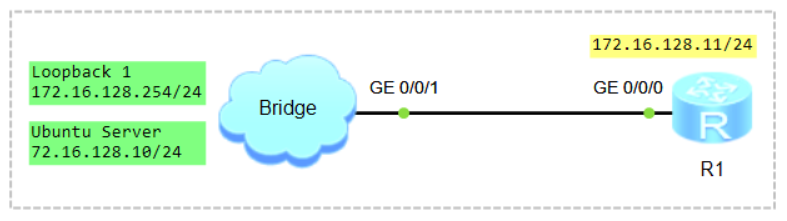

# Network Automation. Python

### 🖧 Network Topology (желі топологиясы)
  

## Scenario
1) Configure Remote Access (Telnet, SSH);
2) Python TELNET Library;
3) Python Netmiko Library;
4) Python NAPALM Library.

## Configure Remote Access (Telnet, SSH)

```shell
Configure Local User Authentication and Authorization
aaa
 local-user user1 password irreversible-cipher Huawei@123
 local-user user1 service-type terminal ssh
 local-user user1 privilege level 15
```

```shell
ssh user student authentication-type password
ssh user student service-type stelnet
```

```shell
Configure VTY Lines
user-interface vty 0 4
 authentication-mode aaa
 protocol inbound all
```

```shell
Generate RSA Key
rsa local-key-pair create

Warning: Confirm to replace them! Continue? [Y/N] Y
Input the bits in the modulus[default = 3072]: 2048

display rsa local-key-pair public
```

```shell
Enable SSH
stelnet server enable

display ssh server status
display telnet server status
```

```shell
student@ubuntu:~$ sudo nano ~/.ssh/config
Host 172.16.128.11
    KexAlgorithms +diffie-hellman-group1-sha1
    HostKeyAlgorithms +ssh-rsa
    PubkeyAcceptedAlgorithms +ssh-rsa
    Ciphers +aes128-cbc
CTRL+O, ENTER, CTRL+X
```
немесе
```shell
student@ubuntu:~$ sudo nano ~/.ssh/config
Ciphers aes128-ctr,aes192-ctr,aes256-ctr,aes128-cbc,3des-cbc
KexAlgorithms +diffie-hellman-group-exchange-sha1,diffie-hellman-group1-sha1
HostKeyAlgorithms=+ssh-rsa
CTRL+O, ENTER, CTRL+X
```

```shell
student@ubuntu:~$ ssh user1@172.16.128.11
student@ubuntu:~$ telnet 172.16.128.11
```

## Python TELNET Library

```shell
student@ubuntu:~$ python3 --version
```

```shell
student@ubuntu:~$ sudo nano script1_telnet.py

import telnetlib
import time

host = '172.16.128.11'
user = 'user1'
password = 'Huawei@123'
UserPrompt = '>'
ConfigPrompt = ']'

tn = telnetlib.Telnet(host)

tn.read_until(b'Username:')
tn.write(user.encode('ascii') + b'\n')
tn.read_until(b'Password:')
tn.write(password.encode('ascii') + b'\n')

print('Connection to ' + '172.16.128.11' + ' is Successful')

UserMode = tn.read_until(UserPrompt.encode('ascii'))
print(UserMode.decode('ascii'))

tn.write(b'system-view \n')
ConfigMode = tn.read_until(ConfigPrompt.encode('ascii'))
print(ConfigMode.decode('ascii'))

tn.write(b'sysname R1 \n')
ConfigMode = tn.read_until(ConfigPrompt.encode('ascii'))
print(ConfigMode.decode('ascii'))

tn.write(b'display version \n')
ConfigMode = tn.read_until(ConfigPrompt.encode('ascii'))
print(ConfigMode.decode('ascii'))

tn.close()

CTRL+O, ENTER, CTRL+X
```

```shell
student@ubuntu:~$ python3 script1_telnet.py
```

```shell
student@ubuntu:~$ sudo nano script2_telnet.py

import telnetlib
import time

host = '172.16.128.11'
user = 'user1'
password = 'Huawei@123'
UserPrompt = '>'
ConfigPrompt = ']'

tn = telnetlib.Telnet(host)

tn.read_until(b'Username:')
tn.write(user.encode('ascii') + b'\n')
tn.read_until(b'Password:')
tn.write(password.encode('ascii') + b'\n')

print('Connection to ' + '172.16.128.11' + ' is Successful')

UserMode = tn.read_until(UserPrompt.encode('ascii'))
print(UserMode.decode('ascii'))

tn.write(b'system-view \n')
ConfigMode = tn.read_until(ConfigPrompt.encode('ascii'))
print(ConfigMode.decode('ascii'))

tn.write(b'interface Loopback 0 \n')
ConfigMode = tn.read_until(ConfigPrompt.encode('ascii'))
print(ConfigMode.decode('ascii'))

tn.write(b'ip address 50.1.1.1 32 \n')
ConfigMode = tn.read_until(ConfigPrompt.encode('ascii'))
print(ConfigMode.decode('ascii'))

tn.write(b'display ip interface brief \n')
ConfigMode = tn.read_until(ConfigPrompt.encode('ascii'))
print(ConfigMode.decode('ascii'))

tn.close()

CTRL+O, ENTER, CTRL+X
```

```shell
```shell
student@ubuntu:~$ python3 script2_telnet.py
```
```

```shell
```

```shell
```

```shell
```

```shell
```
