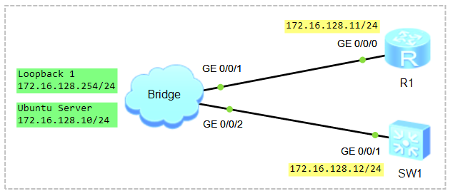
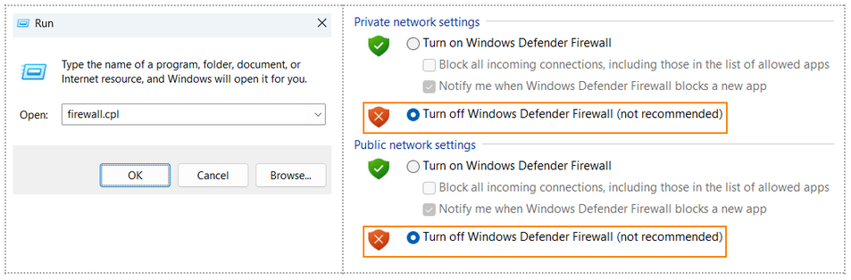

# Network Programmability and Automation. Ansible

### 🖧 Network Topology
  
[Download Link for eNSP Topology File](Topology/Lab14_NetworkTopology_Programmability_Automation.topo)  

## Scenario
1) Configure Remote Access (SSH);
2) Ansible on Ubuntu Server.

## Configure Remote Access (SSH)

**Configure Huawei VRP Router**

```shell
# Configure Local User Authentication and Authorization
aaa
 local-user user1 password cipher Huawei@123
 local-user user1 service-type terminal ssh
 local-user user1 privilege level 15
```

```shell
# Configure SSH User Settings
ssh user user1 authentication-type password
ssh user user1 service-type stelnet
```

```shell
# Enable SSH
stelnet server enable
display ssh server status
```

```shell
# Generate RSA Key
rsa local-key-pair create

Warning: Confirm to replace them! Continue? [Y/N] Y
Input the bits in the modulus[default = 3072]: 2048

display rsa local-key-pair public
```

```shell
# Configure VTY Lines
user-interface vty 0 4
 authentication-mode aaa
 protocol inbound ssh
```

```shell
# Configure SSH Client Settings
ssh client first-time enable
```

**Configure Ubuntu Server**

```shell
student@ubuntu:~$ sudo nano /etc/netplan/50-cloud-init.yaml
network:
  version: 2
  renderer: networkd
  ethernets:
    ens32:
      dhcp4: true
    ens34:
      dhcp4: false
      addresses:
        - 172.16.128.10/24

CTRL+O, ENTER, CTRL+X
```
> **ЕСКЕРТУ:** *YAML файлында бос орындар (indentation) өте маңызды. Әр қатарда 2 бос орын қолдануды ұмытпаңыз! (Tab пернесін қолданбаған дұрыс)*  

```shell
student@ubuntu:~$ sudo netplan try
немесе
student@ubuntu:~$ sudo netplan apply
```

```shell
student@ubuntu:~$ ip address
```

Windows+R ➜ Turn off Windows Defender Firewall  


Ping from Ubuntu to SW1
```shell
student@ubuntu:~$ ping -c4 172.16.128.12
```

```shell
student@ubuntu:~$ sudo nano ~/.ssh/config
Ciphers aes128-ctr,aes192-ctr,aes256-ctr,aes128-cbc,3des-cbc
KexAlgorithms +diffie-hellman-group-exchange-sha1,diffie-hellman-group1-sha1
HostKeyAlgorithms=+ssh-rsa
CTRL+O, ENTER, CTRL+X
```
немесе
```shell
student@ubuntu:~$ sudo nano ~/.ssh/config
Host 172.16.128.12
    KexAlgorithms +diffie-hellman-group1-sha1
    HostKeyAlgorithms +ssh-rsa
    PubkeyAcceptedAlgorithms +ssh-rsa
    Ciphers +aes128-cbc
CTRL+O, ENTER, CTRL+X
```

```shell
# Verify SSH Connectivity
student@ubuntu:~$ ssh user1@172.16.128.12
```

## Ansible on Ubuntu Server

Installing Ansible on Ubuntu
https://docs.ansible.com/projects/ansible/latest/installation_guide/index.html

```shell
$ sudo apt update
$ sudo apt upgrade -y

$ sudo apt install software-properties-common
$ sudo add-apt-repository --yes --update ppa:ansible/ansible

$ sudo apt update
$ sudo apt install ansible -y
```

```shell
$ ansible-galaxy collection install community.network
```

```shell
$ ansible --version
$ ansible-playbook --version
```

```shell
$ sudo apt install -y python3-pip python3-venv

Create Virtual Environment
$ python3 -m venv ansible_huawei_vrp

Activate Virtual Environment
$ source ansible_huawei_vrp/bin/activate

$ python3
CTRL+D

Deactivate Virtual Environment
(ansible_huawei_vrp) student@ubuntu:~$ deactivate
student@ubuntu:~$
```

```shell
$ source ansible_huawei_vrp/bin/activate

$ python3 -m pip install --upgrade pip
$ python3 -m pip install ansible
$ python3 -m pip install paramiko
$ python3 -m pip list
```

```shell
$ ls -l /etc/ansible/
```

```shell
$ sudo nano /etc/ansible/inventory.yml
all:
  hosts:
    switch:
      ansible_host: 172.16.128.12
      ansible_user: user1
      ansible_password: Huawei@123
      ansible_network_os: community.network.ce
      ansible_connection: ansible.netcommon.network_cli
```

немесе

Modern model (заманауи үлгі)
```shell
$ sudo nano /etc/ansible/inventory.yml
all:
  children:
    switches:
      hosts:
        SW1:
          ansible_host: 172.16.128.12
        SW2:
          ansible_host: 172.16.128.13
      vars:
        ansible_user: user1
        ansible_password: Huawei@123
        ansible_ssh_port: 22
        ansible_network_os: community.network.ce
        ansible_connection: ansible.netcommon.network_cli
        is_production: true
```

немесе

Traditional model (дәстүрлі үлгі)
```shell
[switches]
SW1 ansible_host=172.16.128.12
SW2 ansible_host=172.16.128.13

[switches:vars]
ansible_user=admin
ansible_password=Huawei@123
ansible_network_os=community.network.ce
ansible_connection=ansible.netcommon.network_cli
is_production=true
```

**Example #1: Configure Sysname**
```shell
$ sudo nano /etc/ansible/sysname.yml

---
- name: Huawei VRP Switch Configuration
  hosts: switch
  gather_facts: false

  tasks:
    - name: Configure Sysname
      community.network.ce_command:
        commands:
          - system-view
          - sysname SW1
```

```shell
$ cd /etc/ansible/
$ ansible-playbook -i inventory.yml sysname.yml
```

**Example #2: Create VLANIF interface**
```shell
$ sudo nano /etc/ansible/vlanif.yml

---
- name: Huawei VRP Switch Configuration
  hosts: switch
  gather_facts: false

  tasks:
    - name: Create VLANIF interface
      community.network.ce_command:
        commands:
          - system-view
          - vlan 11
          - quit
          - interface Vlanif 11
          - ip address 172.16.11.1 24
          - quit
```

```shell
$ cd /etc/ansible/
$ ansible-playbook -i inventory.yml vlanif.yml
```

**Example #3: Configure Single-Area OSPF**
```shell
$ sudo nano /etc/ansible/ospf.yml

---
- name: Huawei VRP Switch Configuration
  hosts: switch
  gather_facts: false

  tasks:
    - name: Configure Single-Area OSPF
      community.network.ce_command:
        commands:
          - system-view
          - ospf 1 router-id 50.1.1.1
          - area 0.0.0.0
          - network 172.16.11.0 0.0.0.255
          - quit
          - quit
```

```shell
$ cd /etc/ansible/
$ ansible-playbook -i inventory.yml ospf.yml
```

```shell
```

## Reference Links

1) [Virtual Environments and Packages](https://docs.python.org/3/tutorial/venv.html)
