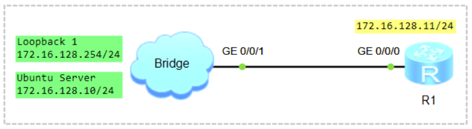

# Network Programmability and Automation. Ansible

### 🖧 Network Topology (желі топологиясы)


## Scenario
1) Configure Remote Access (Telnet, SSH);
2) Ansible.

## Configure Remote Access (SSH)

**Configure Huawei VRP Router**

```shell
Configure Local User Authentication and Authorization
aaa
 local-user user1 password irreversible-cipher Huawei@123
 local-user user1 service-type terminal ssh
 local-user user1 privilege level 15
```

```shell
ssh user user1 authentication-type password
ssh user user1 service-type stelnet
```

```shell
Configure VTY Lines
user-interface vty 0 4
 authentication-mode aaa
 protocol inbound all
```

```shell
Generate RSA Key
rsa local-key-pair create

Warning: Confirm to replace them! Continue? [Y/N] Y
Input the bits in the modulus[default = 3072]: 2048

display rsa local-key-pair public
```

```shell
Enable SSH
stelnet server enable

display ssh server status
```

**Configure Ubuntu Server**

```shell
student@ubuntu:~$ sudo nano /etc/netplan/50-cloud-init.yaml
network:
  version: 2
  renderer: networkd
  ethernets:
    ens32:
      dhcp4: true
    ens34:
      dhcp4: false
      addresses:
        - 172.16.128.10/24

CTRL+O, ENTER, CTRL+X
```
> **ЕСКЕРТУ:** *YAML файлында бос орындар (indentation) өте маңызды. Әр қатарда 2 бос орын қолдануды ұмытпаңыз! (Tab пернесін қолданбаған дұрыс)*  

```shell
student@ubuntu:~$ sudo netplan try
немесе
student@ubuntu:~$ sudo netplan apply
```

```shell
student@ubuntu:~$ ip address
```

Windows+R ➜ Turn off Windows Defender Firewall  


Ping from Ubuntu to R1
```shell
student@ubuntu:~$ ping -c4 172.16.128.11
```

```shell
student@ubuntu:~$ sudo nano ~/.ssh/config
Host 172.16.128.11
    KexAlgorithms +diffie-hellman-group1-sha1
    HostKeyAlgorithms +ssh-rsa
    PubkeyAcceptedAlgorithms +ssh-rsa
    Ciphers +aes128-cbc
CTRL+O, ENTER, CTRL+X
```
немесе
```shell
student@ubuntu:~$ sudo nano ~/.ssh/config
Ciphers aes128-ctr,aes192-ctr,aes256-ctr,aes128-cbc,3des-cbc
KexAlgorithms +diffie-hellman-group-exchange-sha1,diffie-hellman-group1-sha1
HostKeyAlgorithms=+ssh-rsa
CTRL+O, ENTER, CTRL+X
```

```shell
student@ubuntu:~$ ssh user1@172.16.128.11
student@ubuntu:~$ telnet 172.16.128.11
```

## Ansible

```shell
```

```shell
```

```shell
```

```shell
```

```shell
```

```shell
```

```shell
```
