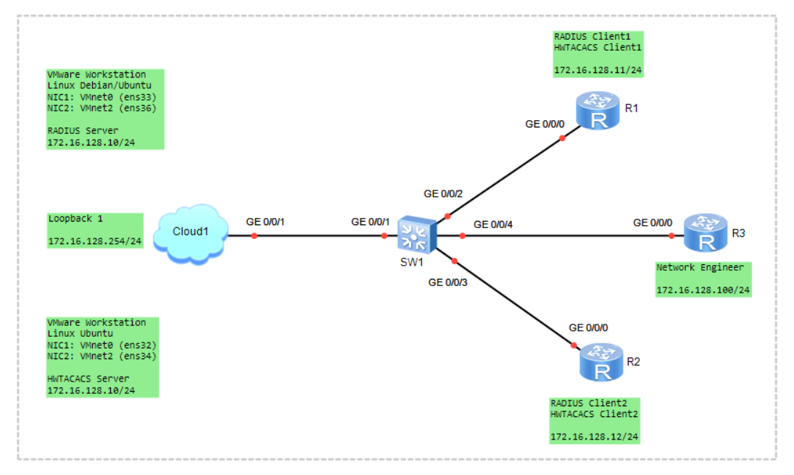
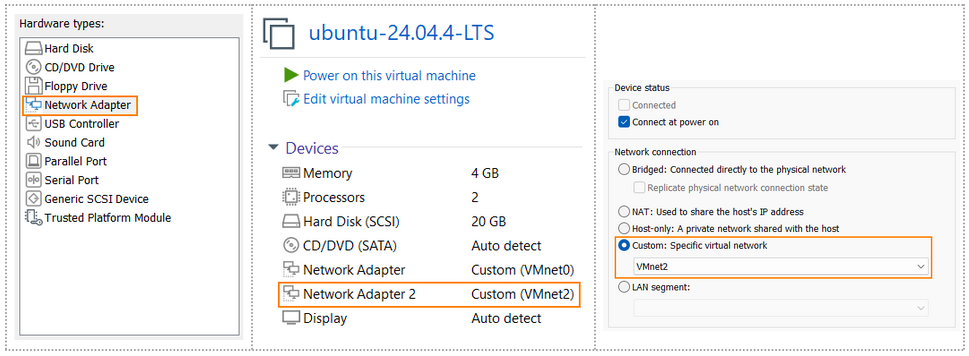
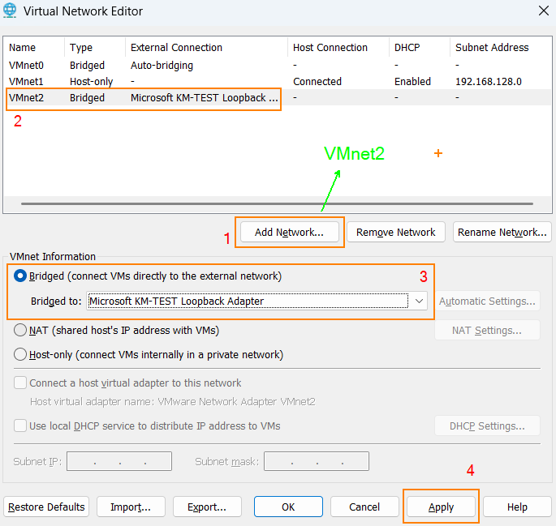
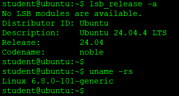
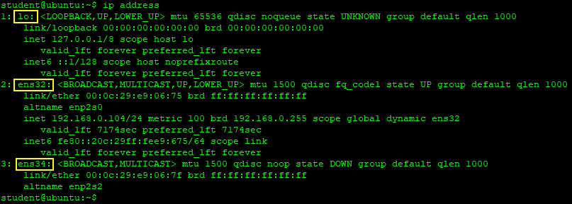
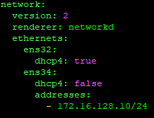
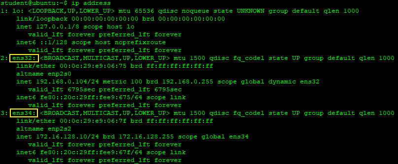
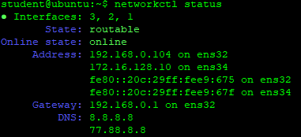

# Remote AAA configuration using RADIUS
> AAA (Authentication, Authorization, Accounting)  

### 🖧 Network Topology
  

> **Ubuntu** — RADIUS Server  
> **R1, R2 (Huawei VRP)** — RADIUS Client  
> **Debian, R3 (Huawei VRP)** — Network Engineer  

## Scenario (RADIUS Client):
1) Basic Device Configuration
     - Configure the IP Address
2) Create a RADIUS Server Template
3) Configure the AAA Scheme
4) Configure the AAA Domain
5) Enable the SSH Server
6) Configure the VTY User Interface
7) Configure Local Backup Authentication
8) Verify the Configuration

# RADIUS Server (Linux) конфигурациясы

VMware Workstation Pro ➜ Virtual Machine Settings ➜ Add Hardware Wizard ➜ ...  


VMware Workstation Pro ➜ Etit ➜ Virtual Network Editor ➜ Change Settings  


```shell
student@ubuntu:~$ lsb_release -a
Ubuntu 24.04.4 LTS
student@ubuntu:~$ uname -rs
Linux 6.8.0-101-generic x86_64 GNU/Linux
```


```shell
student@ubuntu:~$ ip address
```


```shell
student@ubuntu:~$ sudo nano /etc/netplan/50-cloud-init.yaml
network:
  version: 2
  renderer: networkd
  ethernets:
    ens32:
      dhcp4: true
    ens34:
      dhcp4: false
      addresses:
        - 172.16.128.10/24

CTRL+O, ENTER, CTRL+X
```
> **ЕСКЕРТУ:** *YAML файлында бос орындар (indentation) өте маңызды. Әр қатарда 2 бос орын қолдануды ұмытпаңыз! (Tab пернесін қолданбаған дұрыс)*  



```shell
student@ubuntu:~$ sudo netplan apply
немесе
student@ubuntu:~$ sudo netplan try
```

```shell
student@ubuntu:~$ ip address
```


```shell
student@ubuntu:~$ networkctl status
```


Ping from Ubuntu to Host Machine (Loopback 1)
```shell
student@ubuntu:~$ ping -c4 172.16.128.254
```

FreeRADIUS пакеттін (package) орнату
```shell
student@ubuntu:~$ sudo apt update
student@ubuntu:~$ sudo apt install -y freeradius freeradius-utils
```

FreeRADIUS пакеттінің конфигурациялық файлдар тізімі
```shell
student@ubuntu:~$ sudo ls -l /etc/freeradius/3.0/
```

RADIUS клиенттерді қосу
```shell
student@ubuntu:~$ sudo nano /etc/freeradius/3.0/clients.conf
client 172.16.128.11 {
    ipaddr = 172.16.128.11
    secret = Datacom@123
    shortname = R1
    require_message_authenticator = no
    nastype = other
}

CTRL+O, ENTER, CTRL+X
```
Қолданушыларды қосу
```shell
student@ubuntu:~$ sudo nano /etc/freeradius/3.0/users
user1   Cleartext-Password := "Huawei@123"

CTRL+O, ENTER, CTRL+X
```
> ЕСКЕРТУ! Production ортада міндетті түрде MySQL/MariaDB сияқты мәліметтер қорын қолданып, құпиясөзді хэштеу керек!  

Huawei Vendor-Specific Attributes (VSA) қосу
```shell
student@ubuntu:~$ sudo nano /etc/freeradius/3.0/users
user1     Cleartext-Password := "Huawei@123"
     Huawei-Exec-Privilege = 15,
     Service-Type = NAS-Prompt-User

CTRL+O, ENTER, CTRL+X
```

Конфигурациялық файлдың қатесін тексеру
```shell
student@ubuntu:~$ sudo freeradius -CX
"Configuration appears to be OK" деген хабарлама шықса, қате жоқ!
```

Daemon-ды қайты жүктеу және автожүктеу қызметін қосу
```shell
student@ubuntu:~$ sudo systemctl restart freeradius
student@ubuntu:~$ sudo systemctl enable freeradius
```

UFW конфигурациясы
```shell
student@ubuntu:~$ sudo ufw status
student@ubuntu:~$ sudo ufw enable
```
RADIUS порттарын ашу
```shell
student@ubuntu:~$ sudo ufw allow from 172.16.128.0/24 to any port 1812,1813 proto udp
student@ubuntu:~$ sudo ufw reload
```
> 1812 - Authentication Port Number  
> 1813 - Accounting Port Number  

Тексеру
```shell
RADIUS Server (Ubuntu)
student@ubuntu:~$ sudo radtest user1 Huawei@123 127.0.0.1 0 testing123
Access-Accept
```

```shell
Network Engineer (Debian)
student@debian:~$ sudo apt install -y freeradius-utils
student@debian:~$ sudo radtest user1 Huawei@123 172.16.128.10 0 Datacom@123
Access-Accept
```

# RADIUS Client (Huawei VRP) конфигурациясы

Configure the IP Address
```shell
int g0/0/0
 ip address 172.16.128.11 24
display ip int brief
```

Ping from Router to Ubuntu
```shell
[R1] ping 172.16.128.10
```

Create a RADIUS Server Template
```shell
radius-server template LAN1
 radius-server authentication 172.16.128.10 1812 weight 80
 radius-server accounting 172.16.128.10 1813 weight 80
 radius-server shared-key cipher Datacom@123
 quit
```

Configure the AAA Scheme
```shell
aaa
 authentication-scheme RADIUS
  authentication-mode radius local
  quit

 accounting-scheme RADIUS
  accounting-mode radius
  quit
```

Configure the AAA Domain
```shell
 domain LAB.LOCAL
  authentication-scheme RADIUS
  accounting-scheme RADIUS
  radius-server LAN1
  quit
 quit
```

```shell
domain default domain LAB.LOCAL
```
> Configure the Global default Domain for administrations  
> domain default_admin admin  
> domain LAB.LOCAL admin   

Verify the Configuration
```shell
[R1] test-aaa user1 Huawei@123 radius-template LAN1
Account test succeed!
```
```shell
[R1] radius-server test-template LAN1 172.16.128.10 1812 user1 password Huawei@123
```

Қосымша ақпарат!
> RADIUS серверді "Debug" режимге қосу  
> student@ubuntu:~$ sudo systemctl stop freeradius  
> student@ubuntu:~$ sudo freeradius -X  
> [R1] test-aaa user1 Huawei@123 radius-template LAN1  

Enable the SSH Server
```shell
stelnet server enable
display ssh server status

rsa local-key-pair create
Confirm to replace them? (y/n)[n]: y
Input the bits in the modulus[default = 2048]: 2048
```

Configure the VTY User Interface
```shell
user-interface vty 0 4
 authentication-mode aaa
 protocol inbound ssh
```

Configure Local Backup Authentication
```shell
aaa
 local-user student password irreversible-cipher Huawei@123
 local-user student service-type terminal ssh
 local-user student privilege level 15
```
> student қолданушыны жүйеден жою: undo local-user student    

Troubleshooting Commands
```shell
display cu section aaa
display radius-server template LAN1
display domain name LAB.LOCAL
```

Network Engineer (Huawei VRP Router)
```shell
[R3] ssh client first-time enable
[R3] stelnet 172.16.128.11
Please input the username: user1
The server is not authenticated. Continue to access it? (y/n)[n]: y
Save the server's public key? (y/n)[n]: y
Enter password: Huawei@123

R1-ге SSH арқылы кіргеннен кейін, төмендегі командаларды орындап көріңіз!
[R1] display privilege state — Privilege Level тексеру
[R1] display users
```

Network Engineer (Debian Linux)
```shell
student@debian:~$ ssh user1@172.16.128.11
```

Accounting
```shell
student@ubuntu:~$ sudo ls -l /var/log/freeradius/radacct/
student@ubuntu:~$ sudo ls -l /var/log/freeradius/radacct/172.16.128.11/
student@ubuntu:~$ tail -f /var/log/freeradius/radacct/172.16.128.11/detail-YYYYMMDD
```
```shell
[R1] aaa
      recording-scheme RADIUS
      recording-mode radius LAN1
      quit
```
```shell
[R1] aaa
      domain LAB.LOCAL
      command-recording-scheme RADIUS
      quit
```
```shell
[R1] command-privilege level 15 recording-scheme RADIUS
```
```shell
[R3] stelnet 172.16.128.11
     <R1> system-view
     [R1] display version
```
```shell
student@ubuntu:~$ sudo ls -l /var/log/freeradius/radacct/172.16.128.11/
student@ubuntu:~$ tail -f /var/log/freeradius/radacct/172.16.128.11/detail-YYYYMMDD
```

```shell
[R1] radius-server template LAN1
     radius-server source interface g0/0/0
     quit
```

Access Control List (ACL)
```shell
[R1] acl 2000
      rule permit source 172.16.128.100 0.0.0.0
      rule deny source any
      quit

[R1] user-interface vty 0 4
      acl 2000 inbound
      quit
```

Idle-Timeout (Автоматты түрде сессияны жабу)
```shell
[R1] user-interface vty 0 4
      idle-timeout 10 0  # 10 минут, 0 секунд
      quit
```

```shell
```

```shell
```

```shell
```
