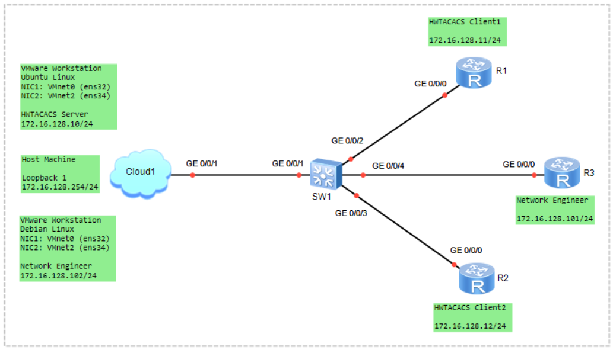

# Remote AAA configuration using HWTACACS
> AAA (Authentication, Authorization, Accounting)  

### 🖧 Network Topology
  

### Scenario (HWTACACS Client):
1) Basic Device Configuration
	- Configure the IP Address (Linux and Router)
2) Create a HWTACACS Server Template
3) Configure the AAA Scheme
4) Configure the AAA Domain
5) Enable the SSH Server
6) Configure the VTY User Interface
7) Configure Local Backup Authentication
8) Verify the Configuration

```shell
student@ubuntu:~$ sudo nano /etc/netplan/50-cloud-init.yaml
network:
  version: 2
  ethernets:
    ens32:
      dhcp4: true
    ens34:
      dhcp4: false
      addresses: [172.16.128.10/24]
CTRL+O, ENTER, CTRL+X

student@ubuntu:~$ sudo netplan apply

student@ubuntu:~$ ip address
ens32: DHCP Assigned
ens34: 172.16.128.10/24
```

```shell
student@ubuntu:~$ sudo apt update
student@ubuntu:~$ sudo apt install -y build-essential flex bison libwrap0-dev libpcre2-dev libssl-dev zlib1g-dev
```

```shell
student@ubuntu:~$ git clone https://github.com/MarcJHuber/event-driven-servers.git
```

```shell
student@ubuntu:~$ cd event-driven-servers
student@ubuntu:~/event-driven-servers$ ./configure tac_plus
student@ubuntu:~/event-driven-servers$ make
student@ubuntu:~/event-driven-servers$ sudo make install

student@ubuntu:~$ which tac_plus
/usr/local/sbin/tac_plus
```

```shell
student@ubuntu:~$ sudo nano /etc/tac_plus.conf

id = spawnd {
    listen = { port = 49 }
}

id = tacacs {
    key = Datacom@123

    user = user1 {
        password = cleartext Huawei@123
        member = admin
    }
	
    user = user2 {
        password = cleartext Huawei@123
        member = operator
    }	

    user = user3 {
        password = cleartext Huawei@123
        member = readonly
    }

    group = admin {
        service = exec {
            priv-lvl = 15
        }
    }

    group = operator {
        service = exec {
            priv-lvl = 5
        }
    }

    group = readonly {
        service = exec {
            priv-lvl = 1
        }
    }
}

CTRL+O, ENTER, CTRL+X
```

```shell
student@ubuntu:~$ sudo tac_plus -b /etc/tac_plus.conf
student@ubuntu:~$ ss -lntp | grep 49
немесе
student@ubuntu:~$ sudo apt install net-tools
student@ubuntu:~$ netstat -an | grep 49
```

**Create Daemon Service (systemd) File**
> Creating a systemd Service Unit  
```shell
student@ubuntu:~$ sudo nano /etc/systemd/system/tac_plus.service
[Unit]
Description=TACACS+ Server
After=network.target

[Service]
ExecStart=/usr/local/sbin/tac_plus /etc/tac_plus.conf
Restart=always
RestartSec=3

[Install]
WantedBy=multi-user.target
```
```shell
student@ubuntu:~$ sudo systemctl daemon-reload
student@ubuntu:~$ sudo systemctl start tac_plus
student@ubuntu:~$ sudo systemctl enable tac_plus
student@ubuntu:~$ sudo systemctl status tac_plus
```

```shell
student@ubuntu:~$ sudo radtest user1 Huawei@123 127.0.0.1 0 testing123
Access-Accept
```

---

**Create a HWTACACS Server Template**
```shell
[R1] hwtacacs enable

hwtacacs-server template LAN2
 hwtacacs-server authentication 172.16.128.10 49
 hwtacacs-server authorization 172.16.128.10 49
 hwtacacs-server accounting 172.16.128.10 49
 hwtacacs-server shared-key cipher Datacom@123
```

**Configure the AAA Scheme**
```shell
aaa
authentication-scheme HWTACACS
 authentication-mode hwtacacs local

authorization-scheme HWTACACS
 authorization-mode hwtacacs local

accounting-scheme HWTACACS
 accounting-mode hwtacacs
 accounting start-fail online
 accounting realtime 3
```

**Configure the AAA Domain**
```shell
aaa
domain LAB.LOCAL
authentication-scheme HWTACACS
authorization-scheme HWTACACS
accounting-scheme HWTACACS
hwtacacs-server LAN2
```

*Configure the global default domain for administrations*
```shell
[R1] domain LAB.LOCAL admin
```
```shell
display hwtacacs-server template LAN2
display domain name LAB.LOCAL
```

**Enable the SSH Server**
```shell
stelnet server enable
display ssh server status

rsa local-key-pair create
```

**Configure the VTY User Interface**
```shell
user-interface vty 0 4
 authentication-mode aaa
 protocol inbound ssh
```

**Configure Local Backup Authentication**
```shell
aaa
 local-user student password irreversible-cipher Huawei@123
 local-user student service-type terminal ssh
 local-user student privilege level 15
```

**Verify the Configuration**
```shell
[R1] test-aaa user1 Huawei@123 hwtacacs-server LAN2

[R3] ssh user1@172.16.128.11
```

### References
1) [Example for Configuring HWTACACS Authentication, Accounting, and Authorization](https://support.huawei.com/enterprise/en/doc/EDOC1000178178/74e8248d/example-for-configuring-hwtacacs-authentication-accounting-and-authorization)
