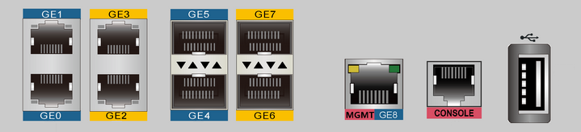
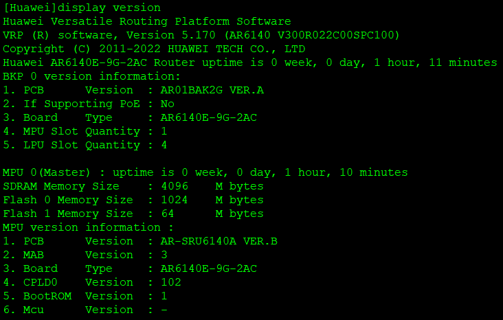

# Remote Access Configuration using SSH

### Huawei AR6140E-9G-2AC Router


**Login authentication**  
**Warning:** *An initial username and password are required for the first login via the console. Set a username and password and keep them safe. Otherwise you will not be able to login via the console.*  
**New Username:** admin  
**Password:** Huawei@123  
**Confirm password:** Huawei@123  
**Info:** *Configuration console exit, please retry to log on*  

**Login authentication**  
**Username:** admin  
**Password:** Huawei@123  

**Warning:** *Auto-Config is working. Before configuring the device, stop Auto-Config. If you perform configurations when Auto-Config is running, the DHCP, routing, DNS, and VTY configurations will be lost. Do you want to **stop Auto-Config?** [y/n]:* **y**  
**Info:** *Auto-Config has been stopped.*  

```shell
system-view
sysname R1

interface GigabitEthernet 0/0/9
 portswitch
 port link-type access
 port default vlan 1
```

```shell
display ip interface brief
```


```shell
aaa
 local-user student password irreversible-cipher Huawei@123
 local-user student service-type terminal ssh
 local-user student privilege level 15
```

```shell
user-interface vty 0 4
 authentication-mode aaa
 protocol inbound ssh
```

Қосымша ақпарат!  
> *жеке (individual) құқық (privilege) - student қолданушыға ғана тиесілі*  
> aaa  
> local-user student privilege level 15  

> жалпы (Global) құқық (privilege) - барлық қолданушыға қатысты  
> user-interface vty 0 4  
> user privilege level 15  

```shell
rsa local-key-pair create
Warning: Confirm to replace them! Continue? [Y/N] Y
Input the bits in the modulus[default = 2048]: 2048
```

```shell
ssh server permit interface Vlanif77
ssh server permit interface GigabitEthernet 0/0/2
немесе
ssh server permit interface all
```

Қосымша ақпарат!  
> ssh server-source -i Vlanif 1  
> ssh server-source all-interface  

> [Huawei] ssh user student  
> [Huawei] ssh user student service-type stelnet  
> [Huawei] ssh user student authentication-type password  

```shell
stelnet server enable

display ssh server status
display current-configuration | include ssh
display current-configuration | include stelnet
```

```shell
ssh student@192.168.1.1
```
